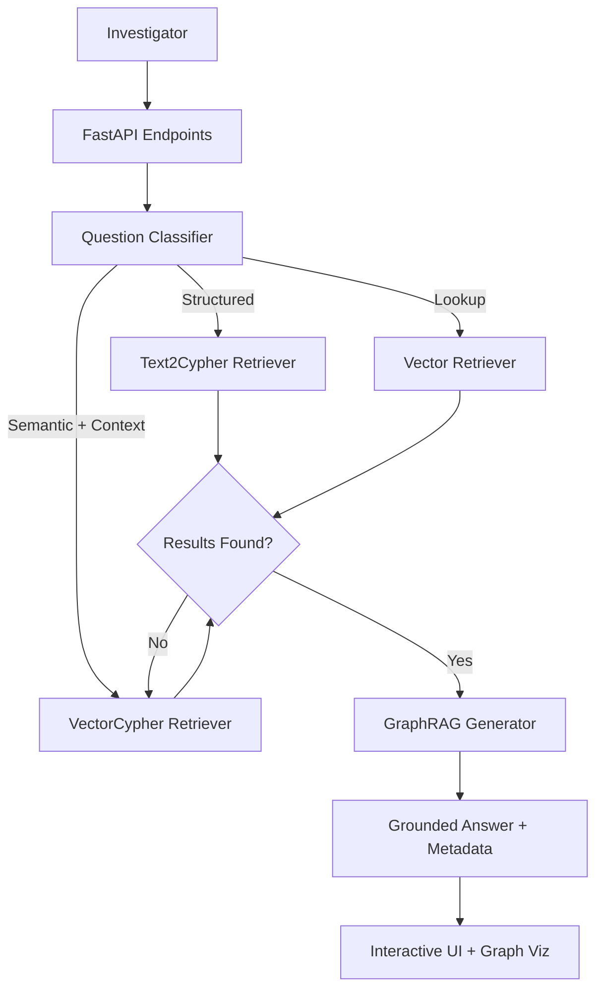

# Investigraph - POLE GraphRAG Investigation System

> A production-ready GraphRAG-powered natural language questioning system for crime investigation knowledge graphs.

Ask questions in plain English, get intelligent answers backed by Neo4j's GraphRAG architecture and multi-strategy retrieval.

---

## Overview

**Investigraph** is an advanced investigation intelligence system built for law enforcement. It leverages a Neo4j GraphRAG-powered pipeline to transform natural language questions into deep insights by combining structured graph queries with semantic vector search.

The system uses the POLE (Person, Object, Location, Event) data model, allowing investigators to explore complex relationships across criminal networks, geographic hotspots, and communication patterns.

### Key Features

- **GraphRAG Architecture**: Combines graph traversal with vector search for context-grounded answer generation.
- **Intelligent Query Routing**: Heuristic-based classification that selects the best retrieval strategy for each question.
- **Triple Retrieval Strategy**:
  - **Text2Cypher**: Precision structured queries with self-healing retry logic.
  - **Vector Search**: Semantic lookup using SentenceTransformer embeddings.
  - **VectorCypher**: Hybrid search that enriches semantic results with graph-traversal context.
- **Groq-Powered Intelligence**: Uses Llama-3.3-70b via Groq for high-speed, high-accuracy reasoning.
- **Interactive Visualization**: Real-time graph rendering showing entities and their relationships.
- **Retriever Metadata**: Transparent feedback on which retriever was used and the context gathered.

---

## Technology Stack

- **Backend**: FastAPI, Python, `neo4j-graphrag` library
- **Graph Database**: Neo4j 5.23+
- **LLM**: Groq Llama-3.3-70b-versatile
- **Embeddings**: SentenceTransformers `all-MiniLM-L6-v2` (384 dimensions)
- **Frontend**: React, TypeScript, Vite, vis-network

---

## System Comparison

| Feature | Old System (Legacy) | New Investigraph (GraphRAG) |
|---|---|---|
| **Pipeline** | Simple NL-to-Cypher | Multi-Strategy GraphRAG |
| **Retrieval** | Single-hop Cypher | Text2Cypher, Vector, VectorCypher |
| **Context** | Raw DB results | Multi-hop graph-enriched context |
| **Error Handling** | Basic retries | Self-healing + Fallback retrievers |
| **AI Framework** | LangChain (Legacy) | Native `neo4j-graphrag` Orchestration |
| **Intelligence** | GPT-3.5/Basic Llama | Groq Llama-3.3-70b-versatile |
| **Visualization** | Basic node list | Metadata-driven relationship graph |

---

## Quick Start

### Prerequisites

- Python 3.10+
- Node.js 18+
- Neo4j Database (5.23+)
- Groq API Key

### 1. Backend Setup

```bash
cd backend

# Create virtual environment
python -m venv venv
source venv/bin/activate  # Windows: venv\Scripts\activate

# Install dependencies
pip install -r requirements.txt

# Configure environment
cp .env.example .env
# Edit .env with your Neo4j and Groq credentials
```

### 2. Embedding Migration (CRITICAL)

Before running the system, you must generate embeddings for the Crime records and create the vector index:

```bash
cd backend
python -m scripts.create_embeddings
```

This script will:
1. Initialize the `all-MiniLM-L6-v2` model.
2. Create `crime_vector_index` on `Crime(embedding)`.
3. Process all Crime nodes in batches to generate 384-dimension vectors.

### 3. Run Application

**Start Backend:**
```bash
cd backend
uvicorn app.main:app --reload --port 8000
```

**Start Frontend:**
```bash
cd frontend
npm install
npm run dev
```

---

## Architecture



---

## Example Questions

- **Structured**: "How many crimes happened in area WN?"
- **Semantic**: "Tell me about incidents involving theft or robbery"
- **Hybrid**: "Show me people connected to drug crimes in the last month"
- **Network**: "Find family members of people involved in drug offences"

---

## Features in Detail

### 1. Intelligent Query Routing

The system classifies questions into three categories:
- **Structured**: Questions involving counts, filters, or complex network hops (uses Text2Cypher).
- **Lookup**: Simple keyword or entity searches (uses Vector search).
- **Semantic**: Exploratory questions requiring deep context (uses VectorCypher).

### 2. Multi-Strategy Retrieval

- **Text2Cypher**: Translates natural language to Cypher with a self-healing retry mechanism that handles syntax errors and empty results.
- **Vector Retriever**: Performs semantic search on high-dimensional embeddings of crime records.
- **VectorCypher Retriever**: Combines semantic search with a subsequent graph traversal to gather neighborhood context (e.g., people, officers, and locations connected to a crime).

### 3. GraphRAG Answer Generation

Answers are synthesized by the Groq Llama-3.3-70b model, grounded strictly in the context retrieved from the graph. This minimizes hallucinations and ensures that every fact in the response is backed by database records.

---

## Project Structure


```
investigraph/
├── backend/                      # FastAPI backend
│   ├── app/
│   │   ├── main.py              # API entry point
│   │   ├── config.py            # Environment config
│   │   ├── database.py          # Neo4j connection
│   │   ├── llm.py               # LLM provider factory
│   │   └── models.py            # Pydantic models
│   ├── core/
│   │   ├── schema_introspector.py   # Schema auto-detection
│   │   ├── few_shot_loader.py       # Load examples
│   │   ├── cypher_generator.py      # LLM query generation
│   │   ├── query_executor.py        # Execute with retry
│   │   ├── answer_generator.py      # NL answer generation
│   │   ├── pipeline.py              # Pipeline orchestration
│   │   └── few_shot_examples.yaml   # 24 curated examples
│   ├── tests/
│   │   ├── test_*.py                # Unit tests
│   │   ├── test_integration.py      # Integration tests
│   │   └── manual_test_checklist.md # Manual test scenarios
│   ├── .env                     # Environment variables
│   ├── requirements.txt         # Python dependencies
│   └── README.md                # Backend docs
│
├── frontend/                    # React frontend
│   ├── src/
│   │   ├── components/          # React components
│   │   ├── services/            # API client
│   │   ├── App.tsx              # Main component
│   │   └── main.tsx             # Entry point
│   ├── package.json             # Node dependencies
│   ├── vite.config.ts           # Vite configuration
│   └── README.md                # Frontend docs
│
├── docker-compose.yml           # Docker orchestration
├── Dockerfile                   # Backend Docker image
├── .dockerignore                # Docker ignore patterns
├── DEPLOYMENT.md                # Deployment guide
├── implementation_plan.md       # Technical specification
└── README.md                    # This file
```

---

## Configuration

### Backend Environment Variables

| Variable | Required | Description |
|----------|----------|-------------|
| `NEO4J_URI` | Yes | Neo4j connection URI |
| `NEO4J_USERNAME` | Yes | Neo4j username |
| `NEO4J_PASSWORD` | Yes | Neo4j password |
| `NEO4J_DATABASE` | No | Database name (default: neo4j) |
| `GROQ_API_KEY` | No* | Groq API key |
| `OPENAI_API_KEY` | No* | OpenAI API key |
| `ANTHROPIC_API_KEY` | No* | Anthropic API key |
| `GOOGLE_API_KEY` | No* | Google API key |
| `LOG_LEVEL` | No | Logging level (default: INFO) |

*At least one LLM API key is required

### Frontend Configuration

Edit `frontend/src/services/api.ts` to change API base URL (default: `/api`).

Edit `frontend/vite.config.ts` to change backend proxy target (default: `http://localhost:8000`).

---

## Performance

### Response Times

Typical response times (on successful first attempt):
- Simple count query: < 1 second
- Relationship query: 1-2 seconds
- Multi-hop query: 2-3 seconds
- Complex aggregation: 3-5 seconds

### Optimization

- Schema cached at startup (not per-request)
- Neo4j connection pooling
- Groq for fastest responses (< 500ms LLM calls)
- Claude/GPT-4o for highest accuracy

### Scaling

For production:
- Use gunicorn with multiple workers
- Enable Redis caching for frequent queries
- Add rate limiting with slowapi
- Use managed Neo4j cluster for HA

---

## Troubleshooting

### "Neo4j connection failed"
- Verify `NEO4J_URI`, `NEO4J_USERNAME`, `NEO4J_PASSWORD` in `.env`
- Check database is online and accessible
- Test connection: `curl http://localhost:8000/api/health`

### "No LLM provider configured"
- Add at least one API key to `.env` (GROQ_API_KEY, OPENAI_API_KEY, etc.)
- Verify API key is valid: check provider dashboard
- Restart backend after updating `.env`

### "Empty results" on valid questions
- Check Neo4j has data: `MATCH (n) RETURN count(n)`
- Verify schema matches POLE structure
- Check logs for Cypher syntax errors
- Try simpler questions first

### Frontend "Connection refused"
- Ensure backend is running on port 8000
- Check CORS configuration in `app/main.py`
- Verify proxy settings in `vite.config.ts`

---

## Contributing

1. Fork the repository
2. Create a feature branch: `git checkout -b feature-name`
3. Write tests for new features
4. Follow existing code style and structure
5. Update documentation
6. Run full test suite: `pytest tests/ -v`
7. Submit pull request

---

## License

MIT License - see LICENSE file for details.

---

## Acknowledgments

Built with:
- [FastAPI](https://fastapi.tiangolo.com/) - Modern Python web framework
- [Neo4j](https://neo4j.com/) - Graph database platform
- [LangChain](https://www.langchain.com/) - LLM orchestration framework
- [React](https://react.dev/) - Frontend library
- [vis-network](https://visjs.org/) - Graph visualization library

---

## Support

- Documentation: See `backend/README.md` and `frontend/README.md`
- Issues: Open a GitHub issue
- Manual Testing: See `backend/tests/manual_test_checklist.md`

---

## Roadmap

Future enhancements:
- [ ] Voice input for questions
- [ ] Export results to PDF/CSV
- [ ] Save and share queries
- [ ] Query history and favorites
- [ ] Advanced graph analytics
- [ ] Real-time collaboration
- [ ] Custom dashboards
- [ ] Role-based access control
