# Investigraph - System Architecture

## High-Level Architecture

Investigraph follows a modern three-tier architecture with AI-powered query generation:

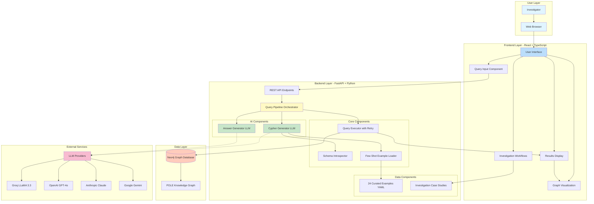

---

## Detailed Component Architecture

### 3-Step Query Pipeline

The system follows a three-step pipeline for processing natural language queries:

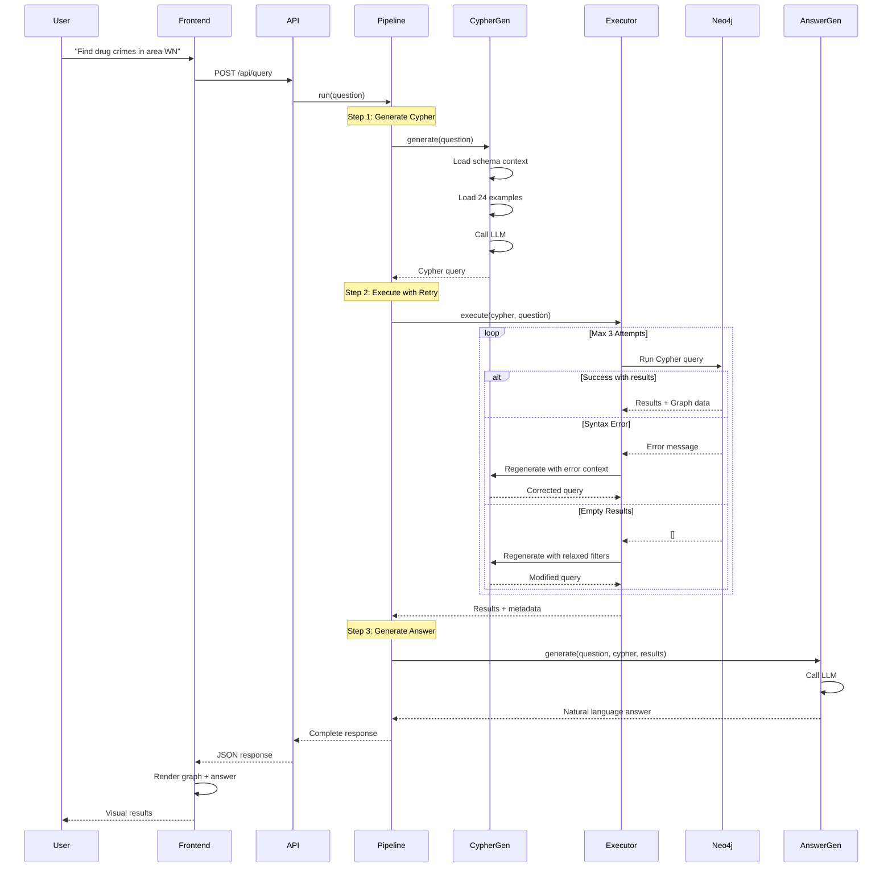

---

## Technology Stack Deep Dive

### Frontend Technologies

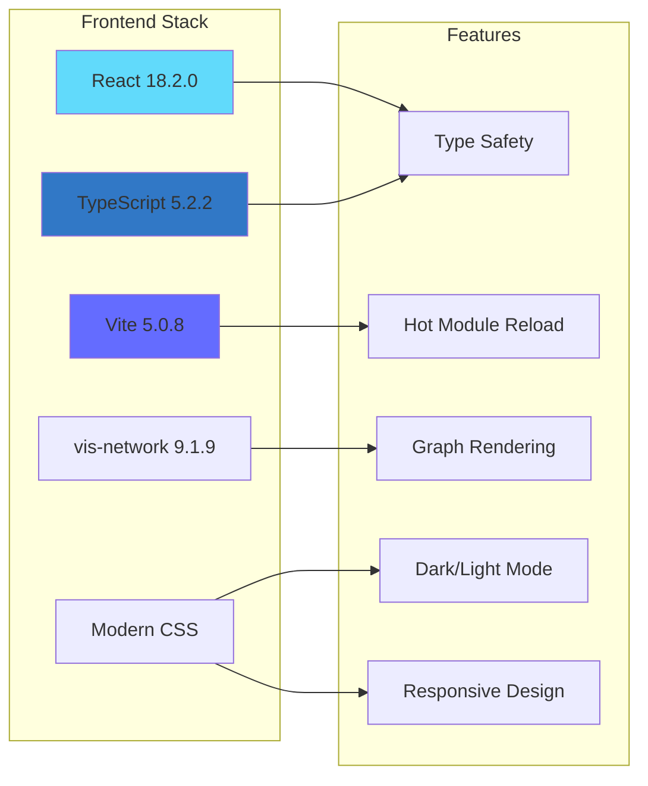

**Frontend Components:**
- **React 18**: Modern React with concurrent rendering
- **TypeScript**: Full type safety, catching errors at compile time
- **Vite**: Lightning-fast build tool with instant HMR
- **vis-network**: Production-grade graph visualization library
- **Component Architecture**:
  - `QueryPanel`: Question input and example questions
  - `ResponsePanel`: Natural language answers
  - `GraphVisualization`: Interactive node-edge rendering
  - `ChatSidebar`: Investigation workflow guidance
  - `InvestigationWorkflows`: Step-by-step case studies

### Backend Technologies

```mermaid
graph TB
    subgraph "Backend Stack"
        FastAPI[FastAPI - Web Framework]
        Pydantic[Pydantic - Data Validation]
        LangChain[LangChain - LLM Orchestration]
        Neo4jDriver[Neo4j Python Driver]
        Python[Python 3.10+]
    end

    subgraph "Core Features"
        AsyncIO[Async/Await Support]
        AutoDocs[Auto-generated API Docs]
        DataValidation[Request/Response Validation]
        LLMAbstraction[Multi-provider LLM Support]
        GraphAccess[Graph Database Access]
    end

    FastAPI --> AsyncIO
    FastAPI --> AutoDocs
    Pydantic --> DataValidation
    LangChain --> LLMAbstraction
    Neo4jDriver --> GraphAccess

    style FastAPI fill:#009688
    style LangChain fill:#1c3c3c
    style Neo4jDriver fill:#008cc1
```

**Backend Components:**

**1. Web Framework (FastAPI)**
- Asynchronous request handling
- Automatic OpenAPI documentation
- CORS support for cross-origin requests
- Request/response validation with Pydantic
- Middleware for logging and error handling

**2. Core Modules**

| Module | Responsibility | Key Features |
|--------|---------------|--------------|
| `pipeline.py` | Orchestrates 3-step query flow | Coordinates all components |
| `schema_introspector.py` | Extracts Neo4j schema | Caches schema, detects labels/relationships |
| `few_shot_loader.py` | Loads training examples | 24 curated query patterns |
| `cypher_generator.py` | NL → Cypher translation | LLM-based with context |
| `query_executor.py` | Query execution + retry | Self-healing with 3 attempts |
| `answer_generator.py` | Results → NL answer | Human-readable summaries |
| `case_study_loader.py` | Investigation workflows | Multi-step investigation patterns |

**3. LLM Integration (LangChain)**
- Abstracted interface for multiple providers
- Prompt template management
- Token usage tracking
- Error handling and retries
- Provider fallback support

### Database Layer

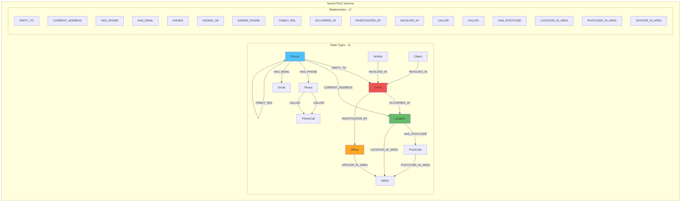

---

## Data Flow Architecture

### Request Flow

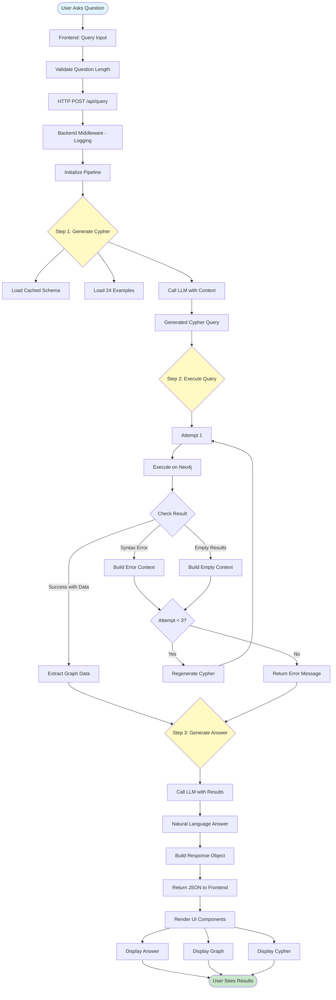

---

## Self-Healing Query Execution

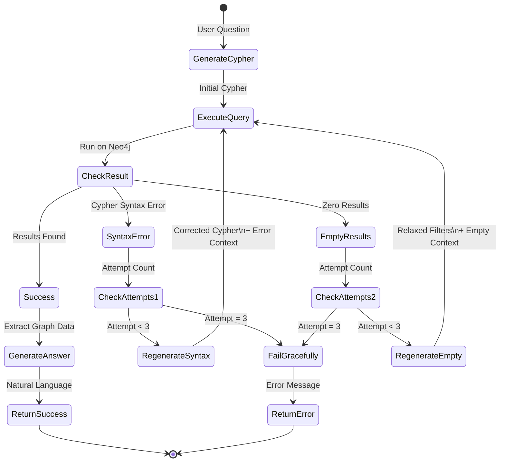

---

## Deployment Architecture

### Docker Containerization

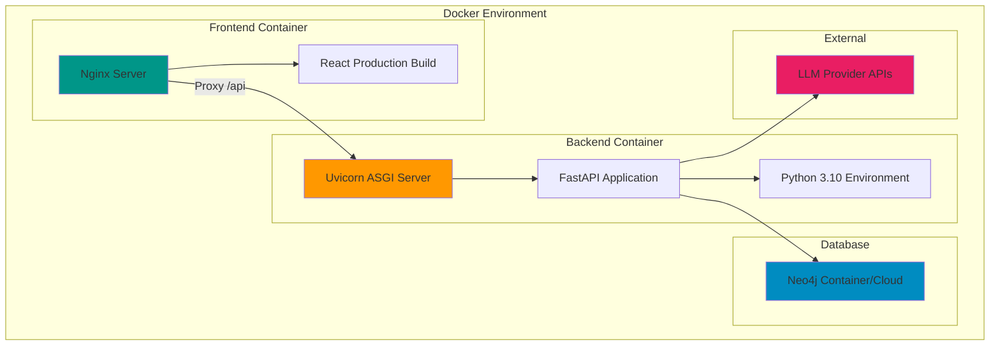

### Cloud Deployment Options

```mermaid
graph LR
    subgraph "Deployment Platforms"
        Heroku[Heroku]
        Render[Render]
        Railway[Railway]
        Vercel[Vercel - Frontend]
        AWS[AWS EC2]
        GCP[Google Cloud Run]
        Azure[Azure Container Apps]
    end

    subgraph "Database Options"
        Neo4jAura[Neo4j Aura Cloud]
        SelfHosted[Self-hosted Neo4j]
    end

    Heroku -->|Connect| Neo4jAura
    Render -->|Connect| Neo4jAura
    Railway -->|Connect| Neo4jAura
    AWS -->|Connect| SelfHosted
    GCP -->|Connect| Neo4jAura
    Azure -->|Connect| SelfHosted

    style Heroku fill:#430098
    style Render fill:#46e3b7
    style Railway fill:#0b0d0e
    style Neo4jAura fill:#008cc1
```

---

## Security Architecture

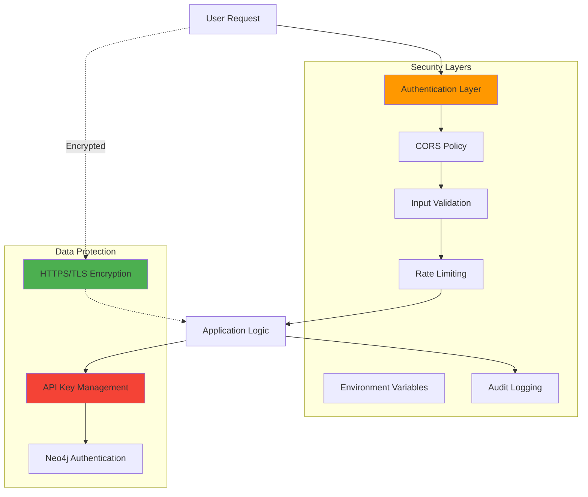

---

## Performance Optimization

### Caching Strategy

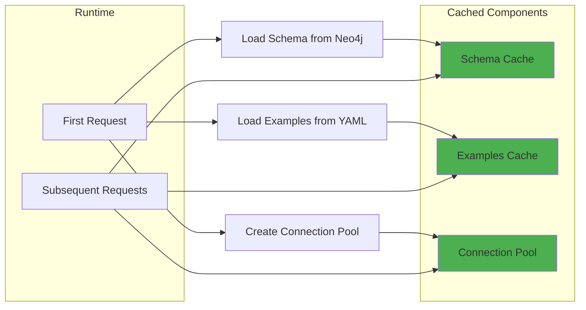

---

## Component Interaction Matrix

| Component | Interacts With | Purpose |
|-----------|---------------|---------|
| **Pipeline** | CypherGen, QueryExecutor, AnswerGen | Orchestrates 3-step flow |
| **CypherGen** | SchemaIntrospector, FewShotLoader, LLM | Generates Cypher from NL |
| **QueryExecutor** | Neo4j, CypherGen | Executes queries with retry |
| **AnswerGen** | LLM | Converts results to NL |
| **SchemaIntrospector** | Neo4j | Extracts and caches schema |
| **FewShotLoader** | YAML files | Loads training examples |
| **Frontend** | Backend API | User interaction layer |
| **Backend API** | Pipeline | Request/response handling |
