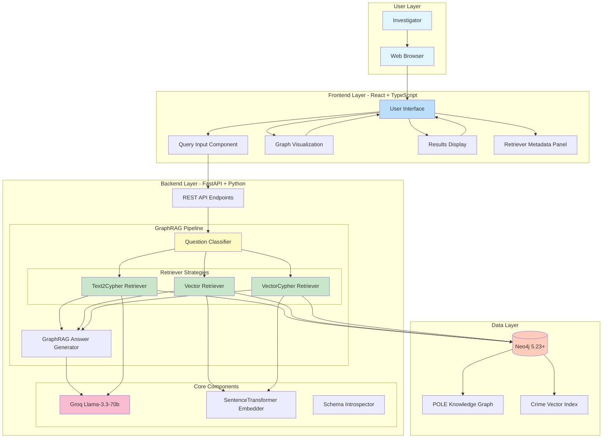
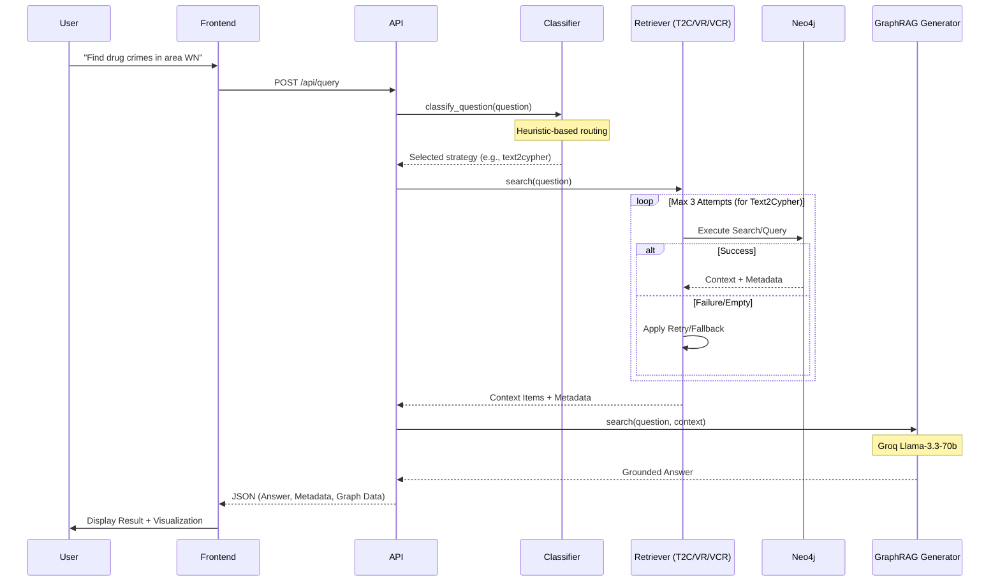
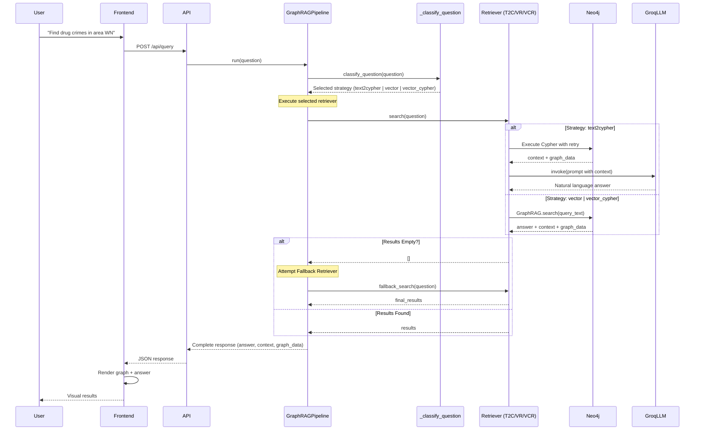
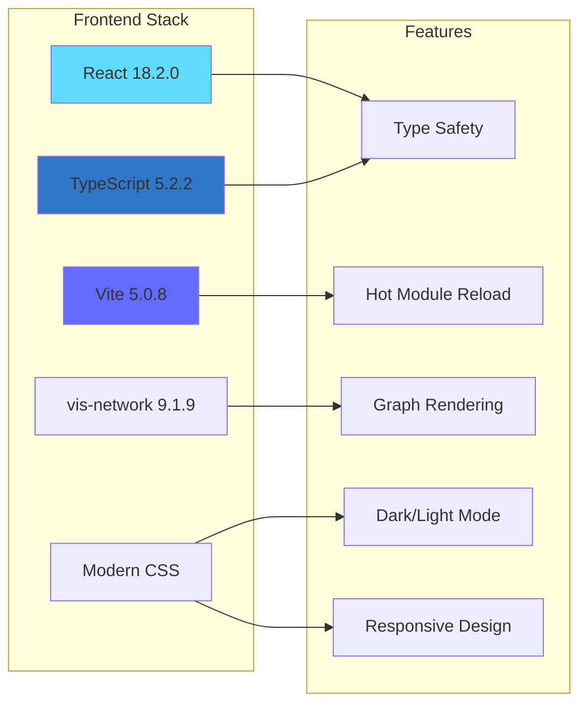
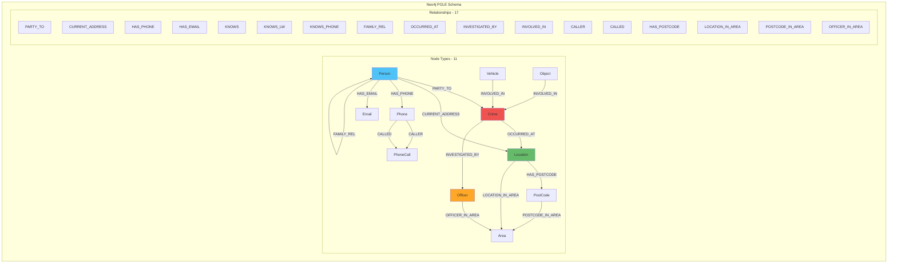
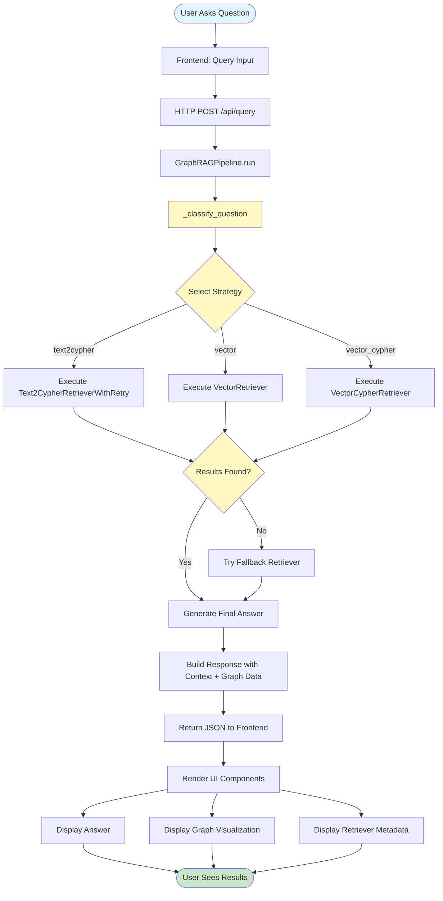
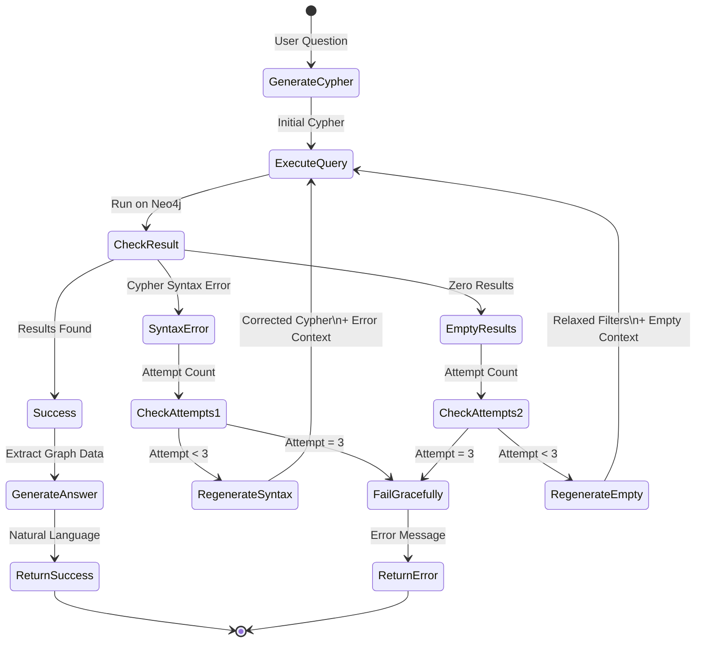
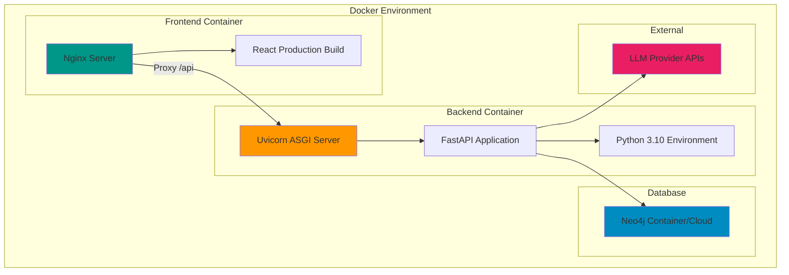
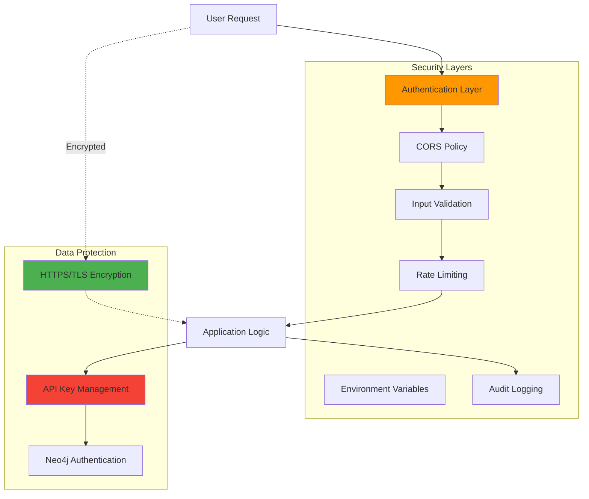
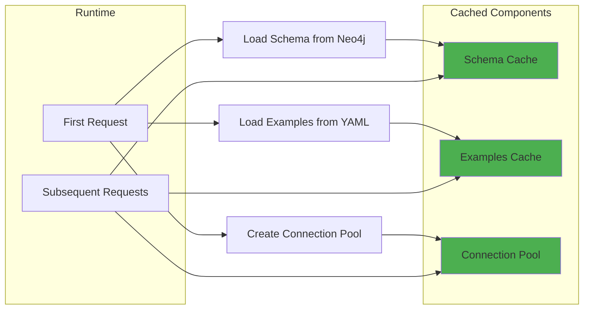

# Investigraph - GraphRAG System Architecture

## High-Level Architecture

Investigraph follows a modern three-tier architecture powered by a Neo4j GraphRAG pipeline:

```mermaid
graph TB
    subgraph "User Layer"
        User[Investigator]
        Browser[Web Browser]
    end

    subgraph "Frontend Layer - React + TypeScript"
        UI[User Interface]
        QueryInput[Query Input Component]
        GraphViz[Graph Visualization]
        Results[Results Display]
        Metadata[Retriever Metadata Panel]
    end

    subgraph "Backend Layer - FastAPI + Python"
        API[REST API Endpoints]
        
        subgraph "GraphRAG Pipeline"
            Classifier[Question Classifier]
            
            subgraph "Retriever Strategies"
                T2C[Text2Cypher Retriever]
                VR[Vector Retriever]
                VCR[VectorCypher Retriever]
            end
            
            Generator[GraphRAG Answer Generator]
        end

        subgraph "Core Components"
            LLM[Groq Llama-3.3-70b]
            Embedder[SentenceTransformer Embedder]
            SchemaIntrospector[Schema Introspector]
        end
    end

    subgraph "Data Layer"
        Neo4j[(Neo4j 5.23+)]
        POLE[POLE Knowledge Graph]
        VectorIndex[Crime Vector Index]
    end

    User --> Browser
    Browser --> UI
    UI --> QueryInput
    UI --> GraphViz
    UI --> Results
    UI --> Metadata

    QueryInput --> API
    API --> Classifier
    
    Classifier --> T2C
    Classifier --> VR
    Classifier --> VCR
    
    T2C --> Generator
    VR --> Generator
    VCR --> Generator
    
    T2C --> Neo4j
    VR --> Neo4j
    VCR --> Neo4j
    
    Generator --> LLM
    T2C --> LLM
    
    VR --> Embedder
    VCR --> Embedder
    
    Neo4j --> POLE
    Neo4j --> VectorIndex

    Results --> UI
    GraphViz --> UI
    
    style User fill:#e1f5ff
    style Browser fill:#e1f5ff
    style UI fill:#bbdefb
    style Classifier fill:#fff9c4
    style T2C fill:#c8e6c9
    style VR fill:#c8e6c9
    style VCR fill:#c8e6c9
    style Neo4j fill:#ffccbc
    style LLM fill:#f8bbd0
```

---

## Detailed Pipeline Flow

The system orchestrates a multi-strategy retrieval process to ensure the most relevant context is gathered for answer generation:

```mermaid
sequenceDiagram
    participant User
    participant Frontend
    participant API
    participant Classifier
    participant Retriever as Retriever (T2C/VR/VCR)
    participant Neo4j
    participant RAG as GraphRAG Generator

    User->>Frontend: "Find drug crimes in area WN"
    Frontend->>API: POST /api/query

    API->>Classifier: classify_question(question)
    Note over Classifier: Heuristic-based routing
    Classifier-->>API: Selected strategy (e.g., text2cypher)

    API->>Retriever: search(question)
    
    loop Max 3 Attempts (for Text2Cypher)
        Retriever->>Neo4j: Execute Search/Query
        alt Success
            Neo4j-->>Retriever: Context + Metadata
        else Failure/Empty
            Retriever->>Retriever: Apply Retry/Fallback
        end
    end

    Retriever-->>API: Context Items + Metadata

    API->>RAG: search(question, context)
    Note over RAG: Groq Llama-3.3-70b
    RAG-->>API: Grounded Answer

    API-->>Frontend: JSON (Answer, Metadata, Graph Data)
    Frontend->>User: Display Result + Visualization
```

---

## Retrieval Strategies

| Strategy | Component | Description | Best For |
|---|---|---|---|
| **Text2Cypher** | `Text2CypherRetrieverWithRetry` | Translates NL to Cypher using schema context. | Counts, complex hops, filtering, aggregations. |
| **Vector Search** | `VectorRetriever` | Pure semantic search on Crime node embeddings. | Keyword lookups, general similarity. |
| **Hybrid Search** | `VectorCypherRetriever` | Semantic search + 2-hop neighborhood traversal. | Exploratory questions requiring social/local context. |

---

## Technology Stack

### Backend
- **FastAPI**: Asynchronous web framework.
- **neo4j-graphrag**: Core orchestration for RAG patterns.
- **Groq**: Llama-3.3-70b-versatile for high-speed inference.
- **SentenceTransformers**: `all-MiniLM-L6-v2` for 384-dimension embeddings.
- **Neo4j 5.23**: Graph database with native vector index support.

### Frontend
- **React 18 + TypeScript**: Type-safe component architecture.
- **Vite**: Modern frontend tooling.
- **vis-network**: Interactive graph visualization.

---

## Data Flow & Fallback Logic

1. **Classification**: The `Question Classifier` analyzes the query.
2. **Primary Retrieval**: The selected retriever attempts to gather context.
3. **Fallback**: If the primary retriever returns empty results, the system automatically falls back to an alternative strategy (e.g., Text2Cypher falls back to VectorCypher).
4. **Answer Generation**: The `GraphRAG Generator` synthesizes the final response using all gathered context.
5. **Visualization**: Graph data is extracted from the retrieved nodes and metadata to populate the interactive UI.

---

## Detailed Component Architecture

### GraphRAG Pipeline Flow

The system follows a multi-strategy retrieval flow for processing natural language queries:

```mermaid
sequenceDiagram
    participant User
    participant Frontend
    participant API
    participant Pipeline as GraphRAGPipeline
    participant Classifier as _classify_question
    participant Retriever as Retriever (T2C/VR/VCR)
    participant Neo4j
    participant LLM as GroqLLM

    User->>Frontend: "Find drug crimes in area WN"
    Frontend->>API: POST /api/query

    API->>Pipeline: run(question)
    Pipeline->>Classifier: classify_question(question)
    Classifier-->>Pipeline: Selected strategy (text2cypher | vector | vector_cypher)

    Note over Pipeline: Execute selected retriever
    Pipeline->>Retriever: search(question)
    
    alt Strategy: text2cypher
        Retriever->>Neo4j: Execute Cypher with retry
        Neo4j-->>Retriever: context + graph_data
        Retriever->>LLM: invoke(prompt with context)
        LLM-->>Retriever: Natural language answer
    else Strategy: vector | vector_cypher
        Retriever->>Neo4j: GraphRAG.search(query_text)
        Neo4j-->>Retriever: answer + context + graph_data
    end

    alt Results Empty?
        Retriever-->>Pipeline: []
        Note over Pipeline: Attempt Fallback Retriever
        Pipeline->>Retriever: fallback_search(question)
        Retriever-->>Pipeline: final_results
    else Results Found
        Retriever-->>Pipeline: results
    end

    Pipeline-->>API: Complete response (answer, context, graph_data)
    API-->>Frontend: JSON response
    Frontend->>Frontend: Render graph + answer
    Frontend-->>User: Visual results
```

---

## Technology Stack Deep Dive

### Frontend Technologies

```mermaid
graph LR
    subgraph "Frontend Stack"
        React[React 18.2.0]
        TS[TypeScript 5.2.2]
        Vite[Vite 5.0.8]
        VisNetwork[vis-network 9.1.9]
        CSS[Modern CSS]
    end

    subgraph "Features"
        TypeSafety[Type Safety]
        HMR[Hot Module Reload]
        GraphRender[Graph Rendering]
        DarkMode[Dark/Light Mode]
        Responsive[Responsive Design]
    end

    React --> TypeSafety
    TS --> TypeSafety
    Vite --> HMR
    VisNetwork --> GraphRender
    CSS --> DarkMode
    CSS --> Responsive

    style React fill:#61dafb
    style TS fill:#3178c6
    style Vite fill:#646cff
```

**Frontend Components:**
- **React 18**: Modern React with concurrent rendering
- **TypeScript**: Full type safety, catching errors at compile time
- **Vite**: Lightning-fast build tool with instant HMR
- **vis-network**: Production-grade graph visualization library
- **Component Architecture**:
  - `QueryPanel`: Question input and example questions
  - `ResponsePanel`: Natural language answers
  - `GraphVisualization`: Interactive node-edge rendering
  - `ChatSidebar`: Investigation workflow guidance
  - `InvestigationWorkflows`: Step-by-step case studies

### Backend Technologies

```mermaid
graph TB
    subgraph "Backend Stack"
        FastAPI[FastAPI - Web Framework]
        Pydantic[Pydantic - Data Validation]
        NeoGraphRAG[neo4j-graphrag - RAG Orchestration]
        Neo4jDriver[Neo4j Python Driver]
        Python[Python 3.10+]
    end

    subgraph "Core Features"
        AsyncIO[Async/Await Support]
        AutoDocs[Auto-generated API Docs]
        DataValidation[Request/Response Validation]
        LLMAbstraction[Multi-provider LLM Support]
        GraphAccess[Graph Database Access]
    end

    FastAPI --> AsyncIO
    FastAPI --> AutoDocs
    Pydantic --> DataValidation
    NeoGraphRAG --> LLMAbstraction
    Neo4jDriver --> GraphAccess

    style FastAPI fill:#009688
    style NeoGraphRAG fill:#1c3c3c
    style Neo4jDriver fill:#008cc1
```

**Backend Components:**

**1. Web Framework (FastAPI)**
- Asynchronous request handling
- Automatic OpenAPI documentation
- CORS support for cross-origin requests
- Request/response validation with Pydantic
- Middleware for logging and error handling

**2. Core Modules**

| Module | Responsibility | Key Features |
|--------|---------------|--------------|
| `graphrag_pipeline.py` | Orchestrates multi-strategy retrieval | Classification, retriever execution, fallback, answer generation |
| `retrievers.py` | Three retriever strategies | Text2CypherWithRetry, VectorRetriever, VectorCypherRetriever |
| `schema_introspector.py` | Extracts Neo4j schema | Caches schema, detects labels/relationships |
| `few_shot_loader.py` | Loads training examples | 40 curated query patterns |
| `prompts.py` | Prompt templates | Text2Cypher generation rules, RAG answer template |
| `case_study_loader.py` | Investigation workflows | Multi-step investigation patterns |

**3. LLM Integration (GroqLLM)**
- Custom `GroqLLM(LLMInterface)` wrapper for neo4j-graphrag compatibility
- Uses Groq Llama-3.3-70b-versatile for all LLM calls
- Implements `invoke()` and `ainvoke()` methods per neo4j-graphrag contract
- Temperature=0, max_tokens=4096

### Database Layer

```mermaid
graph TB
    subgraph "Neo4j POLE Schema"
        subgraph "Node Types - 11"
            Person[Person]
            Crime[Crime]
            Location[Location]
            Vehicle[Vehicle]
            Object[Object]
            Officer[Officer]
            Phone[Phone]
            PhoneCall[PhoneCall]
            Email[Email]
            PostCode[PostCode]
            Area[Area]
        end

        subgraph "Relationships - 17"
            PARTY_TO[PARTY_TO]
            CURRENT_ADDRESS[CURRENT_ADDRESS]
            HAS_PHONE[HAS_PHONE]
            HAS_EMAIL[HAS_EMAIL]
            KNOWS[KNOWS]
            KNOWS_LW[KNOWS_LW]
            KNOWS_PHONE[KNOWS_PHONE]
            FAMILY_REL[FAMILY_REL]
            OCCURRED_AT[OCCURRED_AT]
            INVESTIGATED_BY[INVESTIGATED_BY]
            INVOLVED_IN[INVOLVED_IN]
            CALLER[CALLER]
            CALLED[CALLED]
            HAS_POSTCODE[HAS_POSTCODE]
            LOCATION_IN_AREA[LOCATION_IN_AREA]
            POSTCODE_IN_AREA[POSTCODE_IN_AREA]
            OFFICER_IN_AREA[OFFICER_IN_AREA]
        end
    end

    Person -->|PARTY_TO| Crime
    Person -->|CURRENT_ADDRESS| Location
    Person -->|HAS_PHONE| Phone
    Person -->|HAS_EMAIL| Email
    Person -->|KNOWS| Person
    Person -->|KNOWS_LW| Person
    Person -->|KNOWS_PHONE| Person
    Person -->|FAMILY_REL| Person

    Crime -->|OCCURRED_AT| Location
    Crime -->|INVESTIGATED_BY| Officer

    Vehicle -->|INVOLVED_IN| Crime
    Object -->|INVOLVED_IN| Crime

    Phone -->|CALLER| PhoneCall
    Phone -->|CALLED| PhoneCall

    Location -->|HAS_POSTCODE| PostCode
    Location -->|LOCATION_IN_AREA| Area
    PostCode -->|POSTCODE_IN_AREA| Area
    Officer -->|OFFICER_IN_AREA| Area

    style Person fill:#4fc3f7
    style Crime fill:#ef5350
    style Location fill:#66bb6a
    style Officer fill:#ffa726
```

---

## Data Flow Architecture

### Request Flow

```mermaid
flowchart TD
    Start([User Asks Question]) --> Input[Frontend: Query Input]
    Input --> APICall[HTTP POST /api/query]

    APICall --> PipelineInit[GraphRAGPipeline.run]
    PipelineInit --> Classify[_classify_question]
    
    Classify --> Route{Select Strategy}
    Route -->|text2cypher| T2C[Execute Text2CypherRetrieverWithRetry]
    Route -->|vector| VR[Execute VectorRetriever]
    Route -->|vector_cypher| VCR[Execute VectorCypherRetriever]

    T2C --> Check{Results Found?}
    VR --> Check
    VCR --> Check

    Check -->|No| Fallback[Try Fallback Retriever]
    Check -->|Yes| Generate[Generate Final Answer]
    
    Fallback --> Generate

    Generate --> BuildResponse[Build Response with Context + Graph Data]
    BuildResponse --> ReturnJSON[Return JSON to Frontend]

    ReturnJSON --> RenderUI[Render UI Components]
    RenderUI --> DisplayAnswer[Display Answer]
    RenderUI --> DisplayGraph[Display Graph Visualization]
    RenderUI --> DisplayMetadata[Display Retriever Metadata]

    DisplayAnswer --> End([User Sees Results])
    DisplayGraph --> End
    DisplayMetadata --> End

    style Start fill:#e1f5ff
    style Classify fill:#fff9c4
    style Route fill:#fff9c4
    style Check fill:#fff9c4
    style End fill:#c8e6c9
```

---

## Self-Healing Query Execution

```mermaid
stateDiagram-v2
    [*] --> GenerateCypher: User Question

    GenerateCypher --> ExecuteQuery: Initial Cypher

    ExecuteQuery --> CheckResult: Run on Neo4j

    CheckResult --> Success: Results Found
    CheckResult --> SyntaxError: Cypher Syntax Error
    CheckResult --> EmptyResults: Zero Results

    Success --> GenerateAnswer: Extract Graph Data

    SyntaxError --> CheckAttempts1: Attempt Count
    EmptyResults --> CheckAttempts2: Attempt Count

    CheckAttempts1 --> RegenerateSyntax: Attempt < 3
    CheckAttempts1 --> FailGracefully: Attempt = 3

    CheckAttempts2 --> RegenerateEmpty: Attempt < 3
    CheckAttempts2 --> FailGracefully: Attempt = 3

    RegenerateSyntax --> ExecuteQuery: Corrected Cypher\n+ Error Context
    RegenerateEmpty --> ExecuteQuery: Relaxed Filters\n+ Empty Context

    FailGracefully --> ReturnError: Error Message

    GenerateAnswer --> ReturnSuccess: Natural Language

    ReturnSuccess --> [*]
    ReturnError --> [*]
```

---

## Deployment Architecture

### Docker Containerization

```mermaid
graph TB
    subgraph "Docker Environment"
        subgraph "Frontend Container"
            NginxContainer[Nginx Server]
            ReactBuild[React Production Build]
        end

        subgraph "Backend Container"
            UvicornContainer[Uvicorn ASGI Server]
            FastAPIApp[FastAPI Application]
            PythonEnv[Python 3.10 Environment]
        end

        subgraph "Database"
            Neo4jContainer[Neo4j Container/Cloud]
        end

        subgraph "External"
            LLMServices[LLM Provider APIs]
        end
    end

    NginxContainer --> ReactBuild
    NginxContainer -->|Proxy /api| UvicornContainer
    UvicornContainer --> FastAPIApp
    FastAPIApp --> PythonEnv
    FastAPIApp --> Neo4jContainer
    FastAPIApp --> LLMServices

    style NginxContainer fill:#009688
    style UvicornContainer fill:#ff9800
    style Neo4jContainer fill:#008cc1
    style LLMServices fill:#e91e63
```

### Cloud Deployment Options

```mermaid
graph LR
    subgraph "Deployment Platforms"
        Heroku[Heroku]
        Render[Render]
        Railway[Railway]
        Vercel[Vercel - Frontend]
        AWS[AWS EC2]
        GCP[Google Cloud Run]
        Azure[Azure Container Apps]
    end

    subgraph "Database Options"
        Neo4jAura[Neo4j Aura Cloud]
        SelfHosted[Self-hosted Neo4j]
    end

    Heroku -->|Connect| Neo4jAura
    Render -->|Connect| Neo4jAura
    Railway -->|Connect| Neo4jAura
    AWS -->|Connect| SelfHosted
    GCP -->|Connect| Neo4jAura
    Azure -->|Connect| SelfHosted

    style Heroku fill:#430098
    style Render fill:#46e3b7
    style Railway fill:#0b0d0e
    style Neo4jAura fill:#008cc1
```

---

## Security Architecture

```mermaid
graph TB
    subgraph "Security Layers"
        Auth[Authentication Layer]
        CORS[CORS Policy]
        EnvVars[Environment Variables]
        Validation[Input Validation]
        RateLimit[Rate Limiting]
        Logging[Audit Logging]
    end

    subgraph "Data Protection"
        Encryption[HTTPS/TLS Encryption]
        Secrets[API Key Management]
        Neo4jAuth[Neo4j Authentication]
    end

    User[User Request] --> Auth
    Auth --> CORS
    CORS --> Validation
    Validation --> RateLimit
    RateLimit --> Application[Application Logic]
    Application --> Logging

    Application --> Secrets
    Secrets --> Neo4jAuth

    User -.->|Encrypted| Encryption
    Encryption -.-> Application

    style Auth fill:#ff9800
    style Encryption fill:#4caf50
    style Secrets fill:#f44336
```

---

## Performance Optimization

### Caching Strategy

```mermaid
graph LR
    subgraph "Cached Components"
        SchemaCache[Schema Cache]
        ExamplesCache[Examples Cache]
        Neo4jPool[Connection Pool]
    end

    subgraph "Runtime"
        FirstRequest[First Request]
        SubsequentRequests[Subsequent Requests]
    end

    FirstRequest --> LoadSchema[Load Schema from Neo4j]
    FirstRequest --> LoadExamples[Load Examples from YAML]
    FirstRequest --> CreatePool[Create Connection Pool]

    LoadSchema --> SchemaCache
    LoadExamples --> ExamplesCache
    CreatePool --> Neo4jPool

    SubsequentRequests --> SchemaCache
    SubsequentRequests --> ExamplesCache
    SubsequentRequests --> Neo4jPool

    style SchemaCache fill:#4caf50
    style ExamplesCache fill:#4caf50
    style Neo4jPool fill:#4caf50
```

---

## Component Interaction Matrix

| Component | Interacts With | Purpose |
|-----------|---------------|---------|
| **GraphRAGPipeline** | Retrievers, GroqLLM, Embedder | Orchestrates classification → retrieval → answer |
| **Text2CypherRetrieverWithRetry** | Neo4j, GroqLLM, SchemaIntrospector | Generates and executes Cypher with self-healing retry |
| **VectorRetriever** | Neo4j Vector Index, Embedder | Semantic search on Crime embeddings |
| **VectorCypherRetriever** | Neo4j Vector Index, Embedder, Neo4j Graph | Hybrid: vector search + graph traversal |
| **GroqLLM** | Groq API | LLM inference (Llama-3.3-70b) |
| **Embedder** | SentenceTransformers | all-MiniLM-L6-v2 (384-dim) embeddings |
| **SchemaIntrospector** | Neo4j | Extracts and caches schema |
| **FewShotLoader** | YAML files | Loads 40 training examples |
| **Frontend** | Backend API | User interaction layer |
| **Backend API** | GraphRAGPipeline | Request/response handling |
