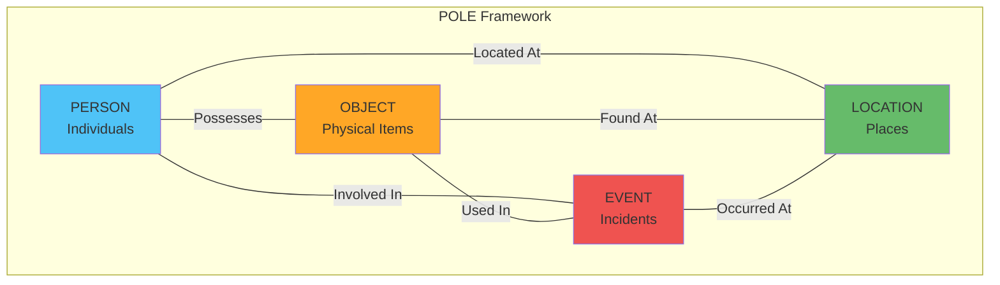

# Investigraph - Dataset Documentation

## Overview

Investigraph operates on a **POLE (Person, Object, Location, Event) knowledge graph** stored in Neo4j. This industry-standard data model is specifically designed for law enforcement intelligence and investigation management.

---

## POLE Data Model Explained

### What is POLE?

POLE is a structured framework for organizing investigation data into four core entity types:



### Why POLE for Investigations?

| Benefit | Description |
|---------|-------------|
| **Relationship-Centric** | Focuses on connections between entities |
| **Investigation-Aligned** | Mirrors how investigators think about cases |
| **Standardized** | Industry standard used globally |
| **Flexible** | Accommodates diverse investigation types |
| **Queryable** | Enables complex relationship queries |

---

## Dataset Schema

### Node Types (11 Labels)

#### 1. Person
**Purpose**: Individuals involved in investigations (suspects, victims, witnesses)

**Properties**:
```yaml
id: string              # Unique identifier (e.g., "P001")
name: string           # First name
surname: string        # Last name
dob: date             # Date of birth (YYYY-MM-DD)
gender: string        # Male, Female, Other
ethnicity: string     # Ethnic background
```

**Example**:
```json
{
  "id": "P001",
  "name": "John",
  "surname": "Smith",
  "dob": "1985-03-15",
  "gender": "Male",
  "ethnicity": "White British"
}
```

#### 2. Crime
**Purpose**: Criminal incidents and offenses (Events in POLE)

**Properties**:
```yaml
id: string              # Crime reference number (e.g., "C12345")
type: string           # Crime type (Drug Offence, Robbery, etc.)
date: datetime         # When crime occurred
last_outcome: string   # Investigation outcome
charge: string         # Formal charges filed
```

**Crime Types in Dataset**:
- Drug Offence
- Robbery
- Burglary
- Vehicle Crime
- Violence and Sexual Offences
- Theft from Person
- Criminal Damage and Arson
- Public Order
- Shoplifting

**Example**:
```json
{
  "id": "C12345",
  "type": "Drug Offence",
  "date": "2024-01-15T14:30:00",
  "last_outcome": "Under investigation",
  "charge": "Possession with intent to supply"
}
```

#### 3. Location
**Purpose**: Geographic places relevant to investigations

**Properties**:
```yaml
id: string              # Location identifier
street: string         # Street address
postcode: string       # Postal code
latitude: float        # GPS latitude
longitude: float       # GPS longitude
```

**Example**:
```json
{
  "id": "L001",
  "street": "123 High Street",
  "postcode": "BL1 2AB",
  "latitude": 53.5768,
  "longitude": -2.4282
}
```

#### 4. Vehicle
**Purpose**: Vehicles involved in crimes (Objects in POLE)

**Properties**:
```yaml
id: string              # Vehicle ID
reg: string            # License plate registration
make: string           # Manufacturer (Ford, BMW, etc.)
model: string          # Model name
colour: string         # Vehicle color
```

**Example**:
```json
{
  "id": "V001",
  "reg": "AB12 CDE",
  "make": "Ford",
  "model": "Focus",
  "colour": "Blue"
}
```

#### 5. Object
**Purpose**: Evidence items and physical objects

**Properties**:
```yaml
id: string              # Object identifier
description: string    # What the object is
type: string           # Category (weapon, drug, stolen item)
```

**Example**:
```json
{
  "id": "O001",
  "description": "Kitchen knife, 8 inch blade",
  "type": "Weapon"
}
```

#### 6. Officer
**Purpose**: Law enforcement personnel

**Properties**:
```yaml
id: string              # Officer ID/badge number
name: string           # Full name
rank: string           # Police rank
```

**Ranks in Dataset**:
- PC (Police Constable)
- DS (Detective Sergeant)
- DI (Detective Inspector)
- DCI (Detective Chief Inspector)

**Example**:
```json
{
  "id": "OFF123",
  "name": "Sarah Johnson",
  "rank": "DS"
}
```

#### 7. Phone
**Purpose**: Mobile phone numbers linked to individuals

**Properties**:
```yaml
id: string              # Phone ID
number: string         # Phone number
```

#### 8. PhoneCall
**Purpose**: Call records between phones (Events in POLE)

**Properties**:
```yaml
id: string              # Call record ID
datetime: datetime     # When call occurred
duration: integer      # Call length in seconds
```

#### 9. Email
**Purpose**: Email addresses of individuals

**Properties**:
```yaml
id: string              # Email ID
address: string        # Email address
```

#### 10. PostCode
**Purpose**: Postal code areas

**Properties**:
```yaml
id: string              # Postcode identifier
postcode: string       # Postcode (e.g., "BL1", "WN2")
```

#### 11. AREA
**Purpose**: Geographic investigation areas

**Properties**:
```yaml
id: string              # Area ID
name: string           # Area name (BL1, WN, OL, M)
```

**Areas in Dataset**:
- **BL1**: Bolton area
- **WN**: Wigan area
- **OL**: Oldham area
- **M**: Manchester area

---

## Relationship Types (17 Types)

### Person-Related Relationships

#### PARTY_TO
**Direction**: Person → Crime
**Meaning**: Person is involved in a crime (suspect, victim, witness)

**Example**:
```cypher
(Person {name: "John Smith"})-[:PARTY_TO]->(Crime {type: "Drug Offence"})
```

#### CURRENT_ADDRESS
**Direction**: Person → Location
**Meaning**: Person's residential address

#### HAS_PHONE
**Direction**: Person → Phone
**Meaning**: Person owns/uses this phone number

#### HAS_EMAIL
**Direction**: Person → Email
**Meaning**: Person's email address

#### KNOWS
**Direction**: Person → Person
**Meaning**: Social connection between individuals

#### KNOWS_LW
**Direction**: Person → Person
**Meaning**: "Last Week" connection (recent association)

#### KNOWS_PHONE
**Direction**: Person → Person
**Meaning**: Connection established through phone contact

#### FAMILY_REL
**Direction**: Person → Person
**Meaning**: Family relationship

### Crime-Related Relationships

#### OCCURRED_AT
**Direction**: Crime → Location
**Meaning**: Where the crime took place

**Example**:
```cypher
(Crime {type: "Burglary"})-[:OCCURRED_AT]->(Location {street: "123 High St"})
```

#### INVESTIGATED_BY
**Direction**: Crime → Officer
**Meaning**: Officer assigned to investigate this crime

#### INVOLVED_IN
**Direction**: Vehicle|Object → Crime
**Meaning**: This item was used in or related to the crime

### Communication Relationships

#### CALLER
**Direction**: Phone → PhoneCall
**Meaning**: Phone that initiated the call

#### CALLED
**Direction**: Phone → PhoneCall
**Meaning**: Phone that received the call

### Geographic Relationships

#### HAS_POSTCODE
**Direction**: Location → PostCode
**Meaning**: Location's postal code

#### LOCATION_IN_AREA
**Direction**: Location → AREA
**Meaning**: Location falls within this investigation area

#### POSTCODE_IN_AREA
**Direction**: PostCode → AREA
**Meaning**: Postcode belongs to this area

#### OFFICER_IN_AREA
**Direction**: Officer → AREA
**Meaning**: Officer's jurisdiction/assigned area

---

## Dataset Statistics

### Entity Counts (Typical Dataset)

| Entity Type | Count | Description |
|-------------|-------|-------------|
| **Person** | 500-1000 | Suspects, victims, witnesses |
| **Crime** | 200-500 | Recorded incidents |
| **Location** | 300-600 | Crime scenes, addresses |
| **Vehicle** | 100-200 | Involved vehicles |
| **Object** | 50-150 | Evidence items |
| **Officer** | 20-50 | Investigating officers |
| **Phone** | 400-800 | Phone numbers |
| **PhoneCall** | 1000-3000 | Call records |
| **Email** | 200-400 | Email addresses |
| **PostCode** | 50-100 | Postal codes |
| **AREA** | 4-10 | Investigation areas |

### Relationship Density

| Relationship | Typical Count | Density |
|--------------|--------------|---------|
| PARTY_TO | 300-700 | High (multiple people per crime) |
| KNOWS | 800-2000 | Very High (social networks) |
| OCCURRED_AT | 200-500 | High (every crime has location) |
| INVESTIGATED_BY | 200-500 | High (every crime assigned) |
| HAS_PHONE | 400-800 | Medium |
| INVOLVED_IN | 100-300 | Medium (vehicles/objects in crimes) |

---

## Example Dataset Queries

### Simple Entity Queries

**Count all crimes**:
```cypher
MATCH (c:Crime)
RETURN count(c) AS total_crimes
```

**Find all people**:
```cypher
MATCH (p:Person)
RETURN p.name, p.surname, p.dob
LIMIT 10
```

### Relationship Queries

**Find crimes and their locations**:
```cypher
MATCH (c:Crime)-[:OCCURRED_AT]->(l:Location)
RETURN c.type, l.street, c.date
ORDER BY c.date DESC
LIMIT 20
```

**Find people involved in crimes**:
```cypher
MATCH (p:Person)-[:PARTY_TO]->(c:Crime)
RETURN p.name + ' ' + p.surname AS person, c.type, c.date
```

### Multi-Hop Queries

**Find crimes in specific area**:
```cypher
MATCH (c:Crime)-[:OCCURRED_AT]->(l:Location)-[:LOCATION_IN_AREA]->(a:AREA)
WHERE a.name = 'BL1'
RETURN c.type, l.street, c.date
```

**Find criminal networks**:
```cypher
MATCH (p1:Person)-[:PARTY_TO]->(c:Crime)<-[:PARTY_TO]-(p2:Person)
WHERE p1.id < p2.id
RETURN p1.name + ' ' + p1.surname AS person1,
       p2.name + ' ' + p2.surname AS person2,
       c.type AS connected_through
```

### Aggregation Queries

**Crime count by area**:
```cypher
MATCH (c:Crime)-[:OCCURRED_AT]->(l:Location)-[:LOCATION_IN_AREA]->(a:AREA)
RETURN a.name AS area, count(c) AS crime_count
ORDER BY crime_count DESC
```

**Repeat offenders**:
```cypher
MATCH (p:Person)-[:PARTY_TO]->(c:Crime)
WITH p, count(c) AS crime_count
WHERE crime_count > 1
RETURN p.name + ' ' + p.surname AS person, crime_count
ORDER BY crime_count DESC
```

### Network Analysis Queries

**Find people who know criminals**:
```cypher
MATCH (p1:Person)-[:PARTY_TO]->(c:Crime),
      (p2:Person)-[:KNOWS]->(p1)
WHERE NOT (p2)-[:PARTY_TO]->(:Crime)
RETURN DISTINCT p2.name + ' ' + p2.surname AS associate,
       collect(DISTINCT p1.name + ' ' + p1.surname) AS knows_criminals
```

**Communication network of suspects**:
```cypher
MATCH (p:Person)-[:PARTY_TO]->(c:Crime),
      (p)-[:HAS_PHONE]->(phone:Phone)-[:CALLER|CALLED]-(call:PhoneCall),
      (other_phone:Phone)-[:CALLER|CALLED]-(call)
RETURN p.name + ' ' + p.surname AS suspect,
       phone.number AS their_phone,
       other_phone.number AS contacted_phone,
       count(call) AS call_count
ORDER BY call_count DESC
```

---

## Training Data: Few-Shot Examples

The system uses **24 curated examples** to teach the LLM how to generate Cypher queries:

### Example Categories

#### 1. Basic Queries (5 examples)
```yaml
- Question: "How many crimes are recorded?"
  Cypher: MATCH (c:Crime) RETURN count(c) AS total_crimes

- Question: "What are the different types of crimes?"
  Cypher: MATCH (c:Crime) RETURN DISTINCT c.type

- Question: "Show all crimes related to drugs"
  Cypher: MATCH (c:Crime) WHERE toLower(c.type) CONTAINS 'drug'
          RETURN c.id, c.type, c.date
```

#### 2. Relationship Queries (4 examples)
```yaml
- Question: "Who are the people involved in crimes?"
  Cypher: MATCH (p:Person)-[:PARTY_TO]->(c:Crime)
          RETURN p.name, p.surname, c.type

- Question: "Which crimes are investigated by officers?"
  Cypher: MATCH (c:Crime)-[:INVESTIGATED_BY]->(o:Officer)
          RETURN c.type, o.name, o.rank
```

#### 3. Multi-Hop Queries (5 examples)
```yaml
- Question: "Find people involved in drug crimes in area WN"
  Cypher: MATCH (p:Person)-[:PARTY_TO]->(c:Crime)-[:OCCURRED_AT]->
          (l:Location)-[:LOCATION_IN_AREA]->(a:AREA)
          WHERE toLower(c.type) CONTAINS 'drug' AND a.name = 'WN'
          RETURN p.name, p.surname, c.type, l.street
```

#### 4. Aggregation Queries (5 examples)
```yaml
- Question: "Which area has the highest number of crimes?"
  Cypher: MATCH (c:Crime)-[:OCCURRED_AT]->(l:Location)-[:LOCATION_IN_AREA]->(a:AREA)
          RETURN a.name, count(c) AS crime_count
          ORDER BY crime_count DESC
          LIMIT 1
```

#### 5. Network Queries (5 examples)
```yaml
- Question: "Find family members of people involved in crimes"
  Cypher: MATCH (p1:Person)-[:PARTY_TO]->(c:Crime),
                (p1)-[:FAMILY_REL]-(p2:Person)
          RETURN p1.name + ' ' + p1.surname AS criminal,
                 p2.name + ' ' + p2.surname AS family_member,
                 c.type
```

---

## Investigation Case Studies

The dataset supports comprehensive multi-step investigation workflows:

### Case Study 1: Drug Crime Network Investigation

**Objective**: Identify repeat drug offenders and detect criminal networks in a target area

**Steps**:
1. **Geographic Filtering**: Find all crimes in area BL1
2. **Person Identification**: Find people involved in these crimes
3. **Repeat Offender Analysis**: Identify people with multiple offenses
4. **Network Detection**: Map KNOWS relationships between offenders

**Expected Findings**:
- 12-20 drug crimes in BL1 area
- 15-25 individuals involved
- 3-5 repeat offenders
- 2-3 criminal network clusters

### Case Study 2: Communication-Based Investigation

**Objective**: Identify suspicious communication patterns linked to criminal activity

**Steps**:
1. **Call Analysis**: Find phone pairs with high call frequency
2. **Owner Identification**: Identify phone owners
3. **Crime Cross-Reference**: Check if owners are involved in crimes

**Expected Findings**:
- 5-10 high-frequency phone pairs
- 8-15 individuals involved in communications
- 40-60% have criminal involvement

### Case Study 3: Area Crime Hotspot Analysis

**Objective**: Identify high-crime areas and analyze patterns

**Steps**:
1. **Hotspot Identification**: Find area with most crimes
2. **Crime Type Analysis**: Break down crime types in hotspot
3. **Repeat Location Detection**: Find locations with multiple incidents

**Expected Findings**:
- WN area typically has highest crime count (45+ crimes)
- Drug Offence most common (30-40%)
- 5-8 locations are repeat crime scenes

---

## Data Quality & Integrity

### Data Validation

| Aspect | Validation Rule | Example |
|--------|----------------|---------|
| **Unique IDs** | All entities have unique identifiers | Person.id = "P001" |
| **Required Properties** | Core properties must exist | Crime.type cannot be null |
| **Relationship Integrity** | Both nodes must exist | Cannot create PARTY_TO without Person & Crime |
| **Date Formats** | ISO 8601 format | "2024-01-15T14:30:00" |
| **Categorical Values** | Must match predefined lists | Crime.type in [Drug Offence, Robbery, ...] |

### Data Privacy Considerations

- All personal data is **anonymized** or **synthetic** for demonstration
- Real investigation data would require:
  - Access controls
  - Audit logging
  - Data encryption
  - Compliance with data protection laws (GDPR, etc.)

---

## Dataset Extensions

### Future Enhancements

| Enhancement | Description | Benefit |
|-------------|-------------|---------|
| **Temporal Data** | Add time-series crime patterns | Trend analysis |
| **Geospatial** | Enhanced GPS and mapping data | Heatmap visualization |
| **Evidence Chain** | Detailed evidence tracking | Court readiness |
| **Case Files** | Link to document management | Comprehensive view |
| **External Sources** | CCTV, social media intelligence | Richer context |

---

## Dataset Loading & Management

### Schema Creation

```cypher
// Create indexes for performance
CREATE INDEX person_id FOR (p:Person) ON (p.id);
CREATE INDEX crime_id FOR (c:Crime) ON (c.id);
CREATE INDEX location_id FOR (l:Location) ON (l.id);

// Create constraints
CREATE CONSTRAINT person_unique IF NOT EXISTS
FOR (p:Person) REQUIRE p.id IS UNIQUE;

CREATE CONSTRAINT crime_unique IF NOT EXISTS
FOR (c:Crime) REQUIRE c.id IS UNIQUE;
```

### Data Import Process

1. **Prepare CSV files** with entity data
2. **Load nodes** using `LOAD CSV` or Neo4j Import Tool
3. **Create relationships** after all nodes exist
4. **Validate integrity** with constraint checks
5. **Build indexes** for query performance

---

## Summary

The POLE dataset provides a **realistic, structured foundation** for criminal investigation knowledge graphs:

- ✅ **11 entity types** covering all investigation aspects
- ✅ **17 relationship types** enabling complex queries
- ✅ **24 training examples** for AI query generation
- ✅ **3 case study workflows** for guided investigations
- ✅ **Production-ready schema** with indexes and constraints
- ✅ **Flexible and extensible** for various investigation types
