# Investigraph - Mermaid Diagrams Collection

> **All architecture diagrams in Mermaid format for easy rendering**
> Copy these into your presentation tool or use [Mermaid Live Editor](https://mermaid.live/)

---

## 1. High-Level System Architecture

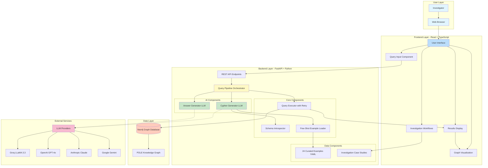

---

## 2. 3-Step Query Pipeline Sequence

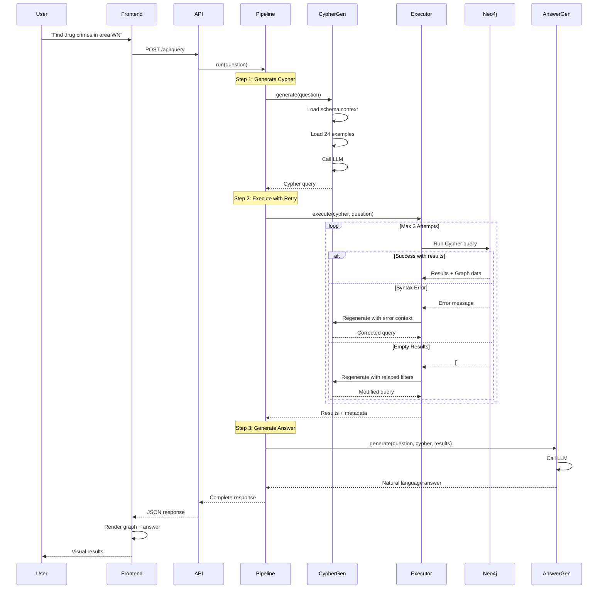

---

## 3. Self-Healing Query Execution State Machine

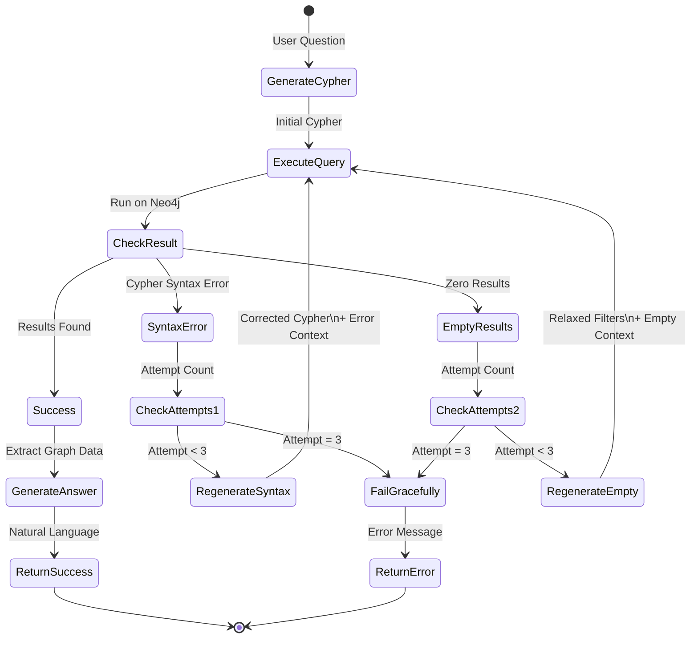

---

## 4. POLE Data Model

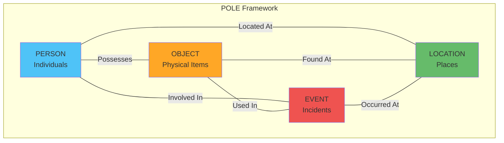

---

## 5. Neo4j POLE Schema

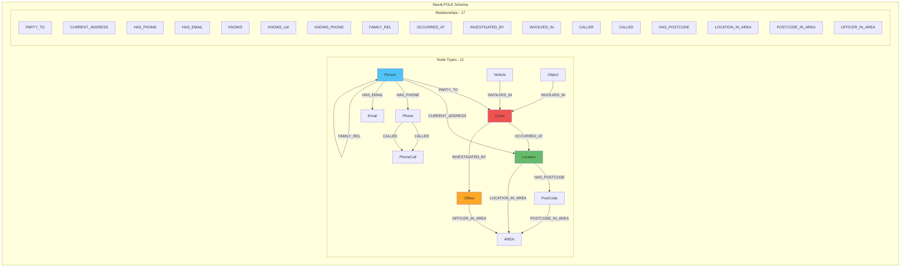

---

## 6. Data Flow Architecture

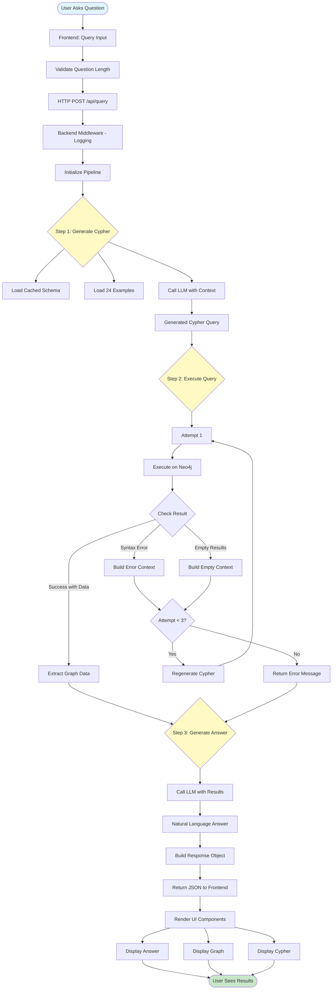

---

## 7. Module 1: Query Generation Flow

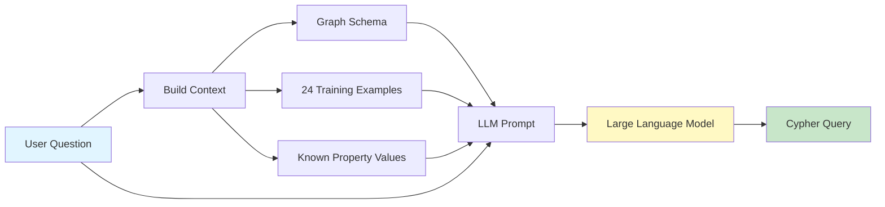

---

## 8. Module 3: Answer Generation Flow

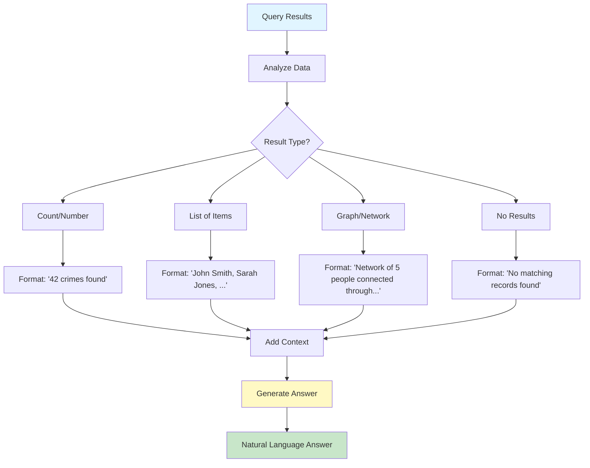

---

## 9. Module 4: Visualization Interface

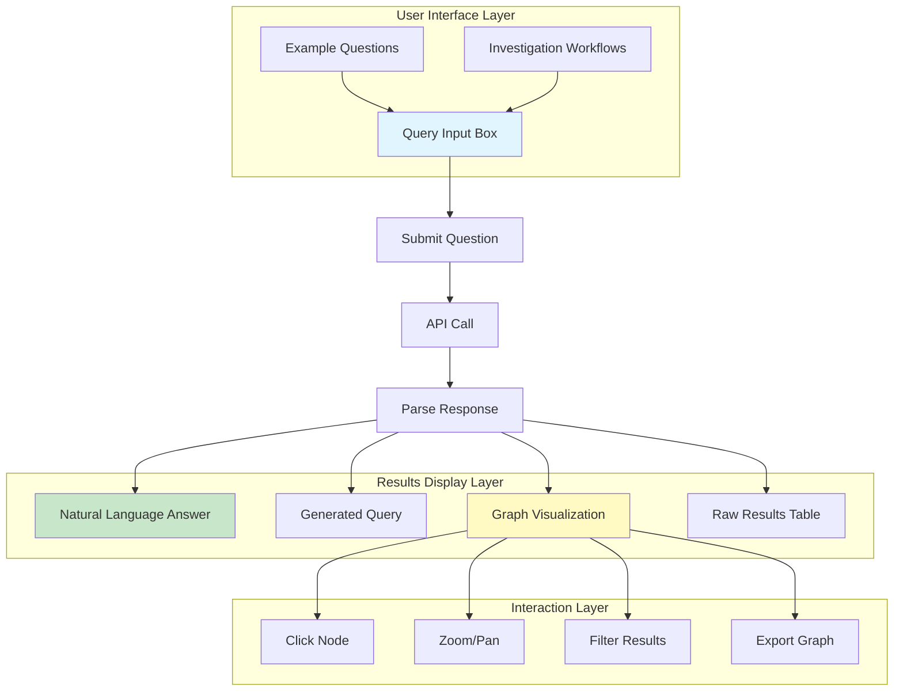

---

## 10. Technology Stack Overview

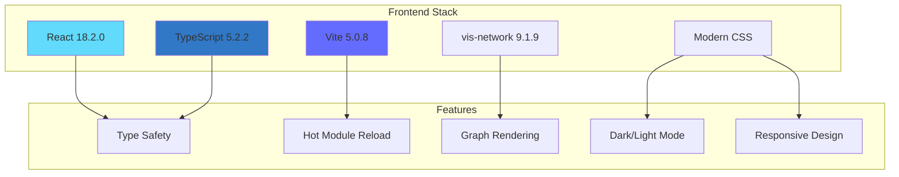

---

## 11. Backend Architecture

```mermaid
graph TB
    subgraph "Backend Stack"
        FastAPI[FastAPI - Web Framework]
        Pydantic[Pydantic - Data Validation]
        LangChain[LangChain - LLM Orchestration]
        Neo4jDriver[Neo4j Python Driver]
        Python[Python 3.10+]
    end

    subgraph "Core Features"
        AsyncIO[Async/Await Support]
        AutoDocs[Auto-generated API Docs]
        DataValidation[Request/Response Validation]
        LLMAbstraction[Multi-provider LLM Support]
        GraphAccess[Graph Database Access]
    end

    FastAPI --> AsyncIO
    FastAPI --> AutoDocs
    Pydantic --> DataValidation
    LangChain --> LLMAbstraction
    Neo4jDriver --> GraphAccess

    style FastAPI fill:#009688
    style LangChain fill:#1c3c3c
    style Neo4jDriver fill:#008cc1
```

---

## 12. Docker Deployment Architecture

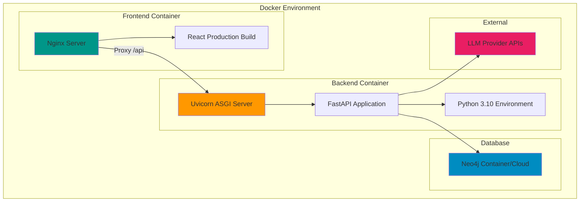

---

## 13. Complete Module Integration Flow

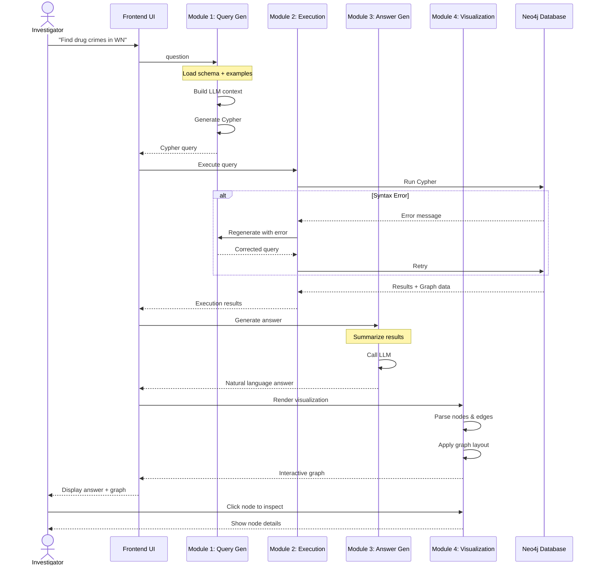

---

## 14. Caching Strategy

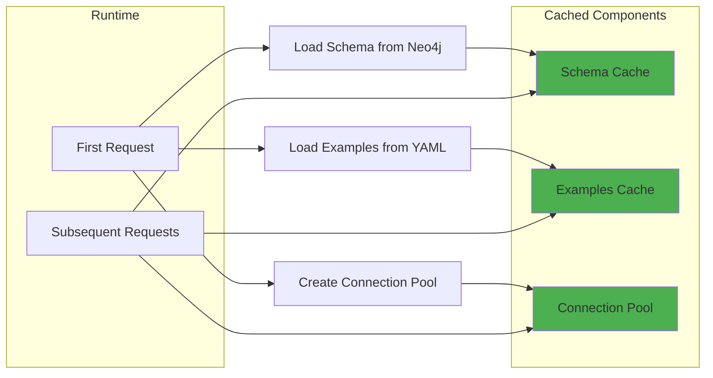

---

## How to Use These Diagrams

### Option 1: Mermaid Live Editor
1. Go to [https://mermaid.live/](https://mermaid.live/)
2. Copy any diagram code above
3. Paste into the editor
4. Export as PNG/SVG for your presentation

### Option 2: VS Code Extension
1. Install "Markdown Preview Mermaid Support" extension
2. Open this file in VS Code
3. Preview renders diagrams automatically
4. Right-click diagram → Copy or Export

### Option 3: Direct Integration
Many presentation tools now support Mermaid:
- Notion
- Obsidian
- GitLab/GitHub README
- Slidev
- Reveal.js

### Option 4: Online Rendering
Use services like:
- [Mermaid Chart](https://www.mermaidchart.com/)
- [Kroki](https://kroki.io/)
- [Excalidraw](https://excalidraw.com/) (for hand-drawn style)

---

## Diagram Color Scheme

For consistency across all diagrams:

| Color | Hex Code | Usage |
|-------|----------|-------|
| Light Blue | `#e1f5ff` | User inputs, starting points |
| Yellow | `#fff9c4` | AI/LLM operations, processing |
| Light Green | `#c8e6c9` | Success states, outputs |
| Light Red | `#ffccbc` | Database operations |
| Pink | `#f8bbd0` | External services |
| Blue (Person) | `#4fc3f7` | Person nodes in POLE |
| Red (Crime) | `#ef5350` | Crime/Event nodes |
| Green (Location) | `#66bb6a` | Location nodes |
| Orange (Officer) | `#ffa726` | Officer/Object nodes |

---

## Tips for Presentation

1. **Start Simple**: Show POLE model first, then build complexity
2. **Interactive Flow**: Use sequence diagrams to show user journey
3. **Technical Deep-Dive**: State machines for error handling details
4. **Context Matters**: Always explain what each diagram shows before displaying it
5. **Zoom In**: For complex diagrams, show sections individually first

Good luck with your presentation! 🎯
