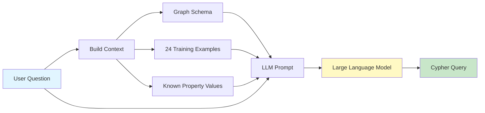
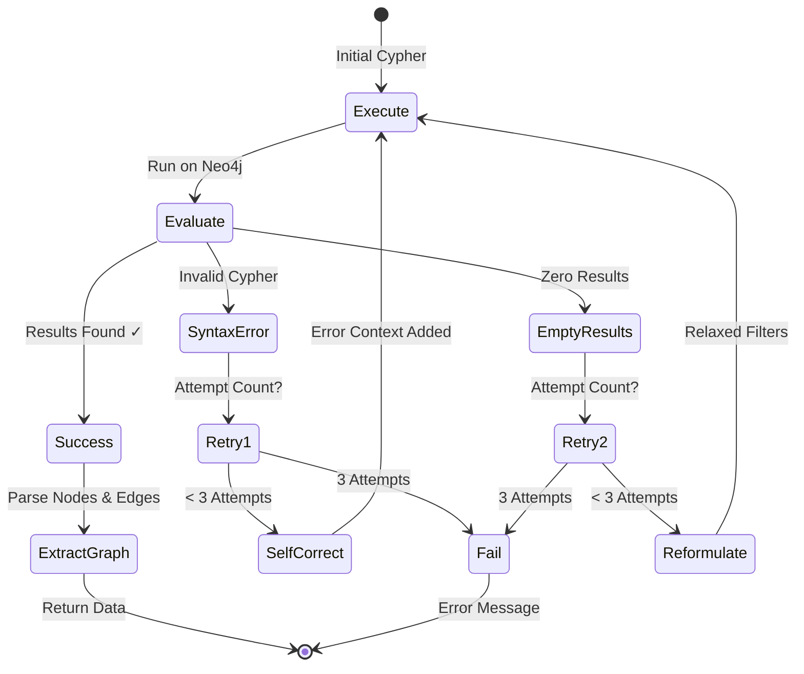
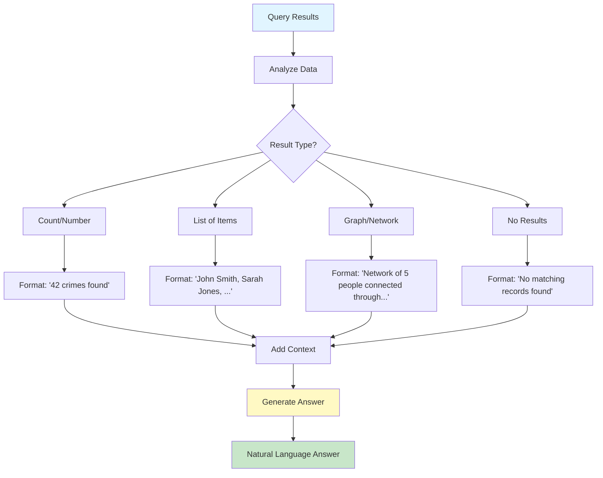
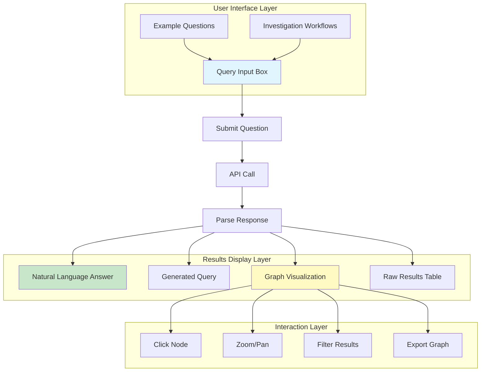
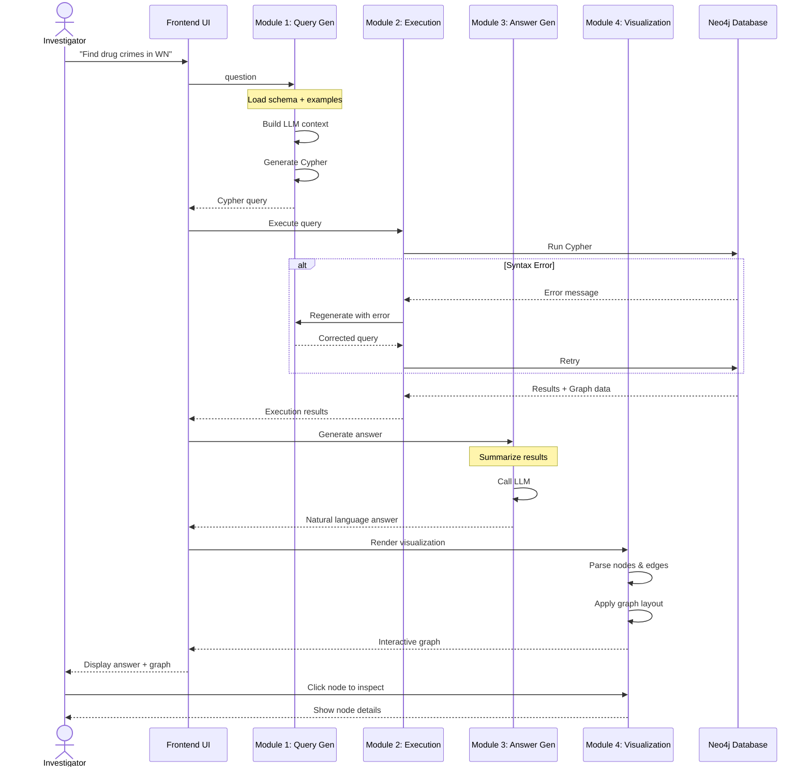

# Investigraph - System Methodology

## Overview

Investigraph employs a **4-module architecture** that transforms natural language questions into actionable investigation insights. Each module is specialized and works in concert to deliver accurate, fast, and reliable results.

---

## Module 1: Natural Language Understanding & Query Generation

### Purpose
Convert investigator questions into precise Cypher graph queries without requiring technical knowledge.

### Components
- **Schema Introspector**: Automatically detects and caches the Neo4j database structure
- **Few-Shot Example Loader**: Provides 24 curated example question-query pairs
- **Cypher Generator (LLM)**: Uses AI to translate natural language to Cypher

### How It Works



### Example Training Patterns

The system is trained on 24 diverse query patterns:

| Category | Example Question | Pattern Type |
|----------|-----------------|--------------|
| **Basic** | "How many crimes are recorded?" | Simple count |
| **Filtering** | "Show crimes related to drugs" | Property filtering |
| **Relationships** | "Who are people involved in crimes?" | Single-hop traversal |
| **Multi-hop** | "Find drug crimes in area WN" | Multiple relationship types |
| **Aggregation** | "Which area has most crimes?" | Grouping and counting |
| **Network** | "Find people who know criminals" | Network traversal |

### Context Building Process

**Step 1: Schema Context**
```
Node Labels (11): Person, Crime, Location, Vehicle, Officer, Phone, PhoneCall, Email, Object, PostCode, AREA

Relationships (17): PARTY_TO, OCCURRED_AT, INVESTIGATED_BY, HAS_PHONE, KNOWS, FAMILY_REL, ...

Person Properties: id, name, surname, dob, gender, ethnicity, ...
Crime Properties: id, type, date, last_outcome, charge, ...
```

**Step 2: Example Context**
```
Example 1:
Question: "Who are involved in crimes?"
Cypher: MATCH (p:Person)-[:PARTY_TO]->(c:Crime) RETURN p.name, c.type

Example 2:
Question: "Which area has most crimes?"
Cypher: MATCH (c:Crime)-[:OCCURRED_AT]->(l:Location)-[:LOCATION_IN_AREA]->(a:AREA)
        RETURN a.name, count(c) AS crime_count ORDER BY crime_count DESC
```

**Step 3: Property Values Context**
```
Crime types: Drug Offence, Robbery, Burglary, Violence
Officer ranks: PC, DS, DI, DCI
Areas: BL1, WN, OL, M
```

### Output
- **Generated Cypher query** optimized for the POLE schema
- Includes: MATCH patterns, WHERE filters, RETURN clauses
- Properly formatted with property accessors and relationship types

---

## Module 2: Intelligent Query Execution with Self-Healing

### Purpose
Execute generated queries against Neo4j with automatic error correction and retry logic.

### Components
- **Query Executor**: Manages query execution lifecycle
- **Neo4j Driver**: Handles database connections with connection pooling
- **Retry Coordinator**: Implements intelligent retry strategy

### How It Works



### Self-Healing Strategies

#### Strategy 1: Syntax Error Correction
**When**: Cypher syntax is invalid (missing parenthesis, wrong property names, etc.)

**Action**:
1. Capture the Neo4j error message
2. Feed error + failed query back to LLM
3. LLM self-corrects the syntax
4. Retry with corrected query

**Example**:
```
Failed Query:
MATCH (p:Person)-[:PARTY_TO]-(c:Crime)
WHERE c.type = 'drug'
RETURN p.name

Error: Property 'drug' is not recognized. Available values: 'Drug Offence', 'Robbery'

Corrected Query:
MATCH (p:Person)-[:PARTY_TO]->(c:Crime)
WHERE c.type = 'Drug Offence'
RETURN p.name, p.surname
```

#### Strategy 2: Empty Results Reformulation
**When**: Query executes successfully but returns no results

**Action**:
1. Notify LLM that query returned empty set
2. LLM analyzes potential issues:
   - Filters too strict?
   - Wrong relationship direction?
   - Incorrect property values?
3. Generate alternative query approach
4. Retry with modified query

**Example**:
```
First Attempt:
MATCH (p:Person)-[:PARTY_TO]->(c:Crime)
WHERE c.type = 'Theft' AND c.date = '2024-01-15'
RETURN p.name
Result: [] (empty)

Second Attempt (relaxed date filter):
MATCH (p:Person)-[:PARTY_TO]->(c:Crime)
WHERE c.type CONTAINS 'Theft'
RETURN p.name, c.date
Result: 12 records found
```

### Performance Optimizations

| Optimization | Benefit |
|--------------|---------|
| **Connection Pooling** | Reuse database connections (20% faster) |
| **Schema Caching** | Avoid repeated schema queries (90% faster) |
| **Query Timeouts** | Prevent long-running queries (5s limit) |
| **Result Limits** | Default LIMIT 100 for large datasets |

### Graph Data Extraction

The executor automatically extracts graph visualization data:

```python
graph_data = {
    "nodes": [
        {"id": "p1", "label": "John Smith", "group": "Person"},
        {"id": "c1", "label": "Drug Offence", "group": "Crime"},
        {"id": "l1", "label": "WN Area", "group": "AREA"}
    ],
    "edges": [
        {"from": "p1", "to": "c1", "label": "PARTY_TO"},
        {"from": "c1", "to": "l1", "label": "OCCURRED_AT"}
    ]
}
```

---

## Module 3: Natural Language Answer Generation

### Purpose
Convert raw query results and graph data into clear, human-readable answers that investigators can immediately understand.

### Components
- **Answer Generator (LLM)**: Synthesizes natural language responses
- **Result Summarizer**: Extracts key insights from data
- **Context Builder**: Combines question, query, and results

### How It Works



### Answer Generation Strategy

**Input Context**:
```
Question: "Which area has the most crimes?"
Cypher: MATCH (c:Crime)-[:OCCURRED_AT]->...
Results: [
  {"area": "WN", "crime_count": 45},
  {"area": "BL1", "crime_count": 32},
  {"area": "OL", "crime_count": 28}
]
```

**Generated Answer**:
```
"The area with the most crimes is WN with 45 recorded incidents,
followed by BL1 (32 crimes) and OL (28 crimes). This suggests WN
is a high-priority area for investigation resources."
```

### Answer Quality Features

| Feature | Description | Example |
|---------|-------------|---------|
| **Quantitative Precision** | Exact numbers and counts | "42 crimes", "5 people" |
| **Ranked Lists** | Ordered by relevance | "Top 3 areas: WN, BL1, OL" |
| **Contextual Insights** | Explains significance | "suggests high criminal activity" |
| **Clear Language** | Non-technical terms | "people involved" not "nodes with PARTY_TO edge" |
| **Action-Oriented** | Suggests next steps | "consider further investigation" |

---

## Module 4: Interactive Visualization & User Interface

### Purpose
Provide investigators with intuitive visual exploration of query results and relationship networks.

### Components
- **React Frontend**: Modern responsive web interface
- **Graph Visualization Engine**: Interactive node-edge rendering
- **Response Panel**: Natural language answer display
- **Query Panel**: Input and example questions
- **Chat Sidebar**: Investigation workflow guidance

### How It Works



### Graph Visualization Features

#### Node Representation
```
Person Node:    🔵 Blue Circle - Shows name
Crime Node:     🔴 Red Circle - Shows crime type
Location Node:  🟢 Green Circle - Shows address
Officer Node:   🟠 Orange Circle - Shows rank + name
Vehicle Node:   🟡 Yellow Circle - Shows make/model
```

#### Edge Representation
```
PARTY_TO        → Solid line (Person ↔ Crime)
KNOWS           → Dashed line (Person ↔ Person)
INVESTIGATED_BY → Arrow (Crime → Officer)
OCCURRED_AT     → Arrow (Crime → Location)
```

#### Interactive Capabilities

| Interaction | Function |
|-------------|----------|
| **Click Node** | View all properties in detail panel |
| **Hover Node** | Quick preview of key info |
| **Drag Node** | Rearrange graph layout |
| **Zoom/Pan** | Explore large networks |
| **Double-click** | Expand connections |
| **Right-click** | Context menu (export, hide, etc.) |

### Investigation Workflow Sidebar

Provides step-by-step guidance for common investigation patterns:

**Example Workflow: Drug Crime Network Investigation**

```
Step 1: Identify crimes in target area
├─ Question: "Show crimes in BL1 area"
├─ Pattern: Geographic filtering
└─ Expected: List of crimes with locations

Step 2: Find persons involved
├─ Question: "Who are involved in these crimes?"
├─ Pattern: PARTY_TO relationship traversal
└─ Expected: Person-Crime connections

Step 3: Identify repeat offenders
├─ Question: "Which people are repeat offenders?"
├─ Pattern: Aggregation with count > 1
└─ Expected: Ranked list by crime count

Step 4: Detect criminal networks
├─ Question: "Are these repeat offenders connected?"
├─ Pattern: KNOWS relationship network traversal
└─ Expected: Social network graph
```

---

## Module Integration Flow

### Complete End-to-End Process



---

## Key Methodology Principles

### 1. Context-Aware Generation
Every query generation includes:
- Full graph schema knowledge
- 24 diverse training examples
- Known property values
- Previous error context (on retry)

### 2. Fail-Safe Execution
- Maximum 3 attempts per query
- Automatic syntax correction
- Intelligent reformulation on empty results
- Graceful degradation with informative errors

### 3. Human-Centric Answers
- Natural language, not technical jargon
- Quantitative precision
- Actionable insights
- Clear explanations

### 4. Visual-First Presentation
- Graph visualizations for relationship understanding
- Color-coded entity types
- Interactive exploration
- Multiple result views (graph, table, answer)

---

## Performance Metrics by Module

| Module | Average Time | Success Rate |
|--------|-------------|--------------|
| **Module 1** (Query Gen) | 200-800ms | 85-95% first attempt |
| **Module 2** (Execution) | 50-500ms | 95%+ with retry |
| **Module 3** (Answer Gen) | 200-600ms | 99%+ |
| **Module 4** (Visualization) | 50-200ms | 100% |
| **Total Pipeline** | 1-3 seconds | 95%+ overall |

---

## Error Handling Across Modules

| Module | Error Type | Handling Strategy |
|--------|-----------|-------------------|
| **Module 1** | LLM timeout | Retry with exponential backoff |
| **Module 1** | Invalid API key | Return clear config error |
| **Module 2** | Syntax error | Self-correct with error context |
| **Module 2** | Empty results | Reformulate with relaxed filters |
| **Module 2** | Connection error | Reconnect with connection pool |
| **Module 3** | LLM timeout | Return results without NL answer |
| **Module 4** | Invalid graph data | Display table view instead |
