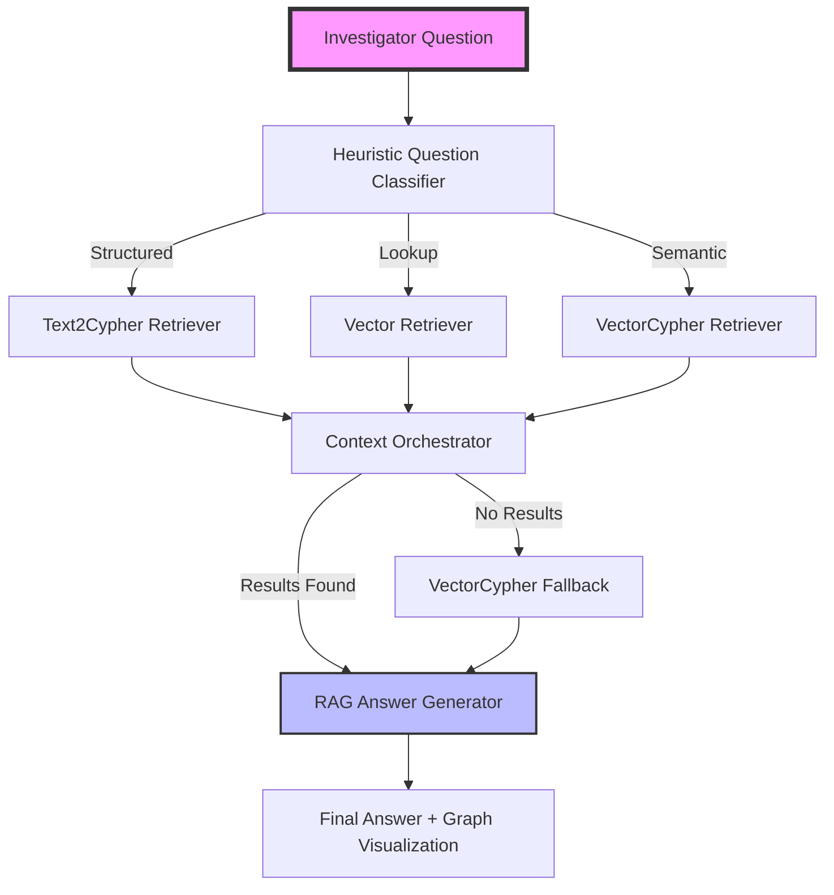

# Investigraph - GraphRAG Investigation System Implementation Plan

> A technical specification for the GraphRAG-powered POLE (Person, Object, Location, Event) crime investigation system.

---

## 1. System Overview

### Goal
To build a state-of-the-art GraphRAG system that transforms natural language investigator questions into intelligent, data-grounded answers by combining structured Cypher generation with semantic vector-enriched retrieval.

### Core Architecture (Multi-Strategy GraphRAG)



---

## 2. Technical Stack

- **Backend**: FastAPI (Python)
- **Graph Database**: Neo4j 5.23+
- **LLM**: Groq Llama-3.3-70b-versatile
- **Embeddings**: SentenceTransformers `all-MiniLM-L6-v2` (384-dim)
- **Orchestration**: `neo4j-graphrag` Python library
- **Frontend**: React + TypeScript + Vite + vis-network

---

## 3. Retrieval Strategies

The system implements three distinct retrieval strategies to ensure high accuracy across different types of investigator queries.

| Strategy | Description | Best For |
|---|---|---|
| **Text2Cypher** | Translates NL to precise Cypher queries using a schema-aware LLM prompt and 40 few-shot examples. | Counts, aggregations, multi-hop joins, and structured filters (e.g., "How many...", "List all..."). |
| **Vector Search** | Semantic search against high-dimensional embeddings of `Crime` nodes stored in Neo4j. | Similarity-based lookups and vague descriptions (e.g., "Tell me about incidents like theft"). |
| **VectorCypher** | Hybrid retrieval: Perform vector search, then traverse the graph to gather neighborhood context. | Deep investigative context (e.g., "Show people and locations connected to drug crimes"). |

---

## 4. Implementation Components

### 4.1 Heuristic Question Classifier
Instead of an expensive LLM call for every routing decision, the system uses a keyword-based heuristic to route questions to the most appropriate retriever.
- **Structured Routing**: Triggered by keywords like "how many", "list", "who", "where", "total", "count".
- **Semantic Routing**: Triggered by exploratory words like "about", "describe", "detail", "similar".

### 4.2 Embedding Migration Script (`scripts/create_embeddings.py`)
A core utility that ensures the graph is ready for GraphRAG operations:
1. Creates `crime_vector_index` on `Crime(embedding)`.
2. Encodes crime node properties (type, charge, note) into 384-dimension vectors.
3. Batch-updates the graph with vector data.

### 4.3 Self-Healing Text2Cypher
A robust execution wrapper that handles:
- **Syntax Errors**: Automatically feeds the Cypher error back to the LLM for correction (max 3 retries).
- **Empty Results**: If a structured query returns no data, the system falls back to a VectorCypher search to find "near matches."

---

## 5. Knowledge Graph Schema (POLE)

The system operates on the POLE (Person, Object, Location, Event) model:

- **Nodes**: `Person`, `Crime`, `Location`, `Vehicle`, `Object`, `Officer`, `Phone`, `Email`, `PostCode`, `Area`.
- **Relationships**: `PARTY_TO`, `OCCURRED_AT`, `INVESTIGATED_BY`, `INVOLVED_IN`, `HAS_PHONE`, `KNOWS`, `FAMILY_REL`, etc.

---

## 6. Success Criteria

- **Accuracy**: At least 85% correct answers across the 40 standard test cases.
- **Performance**: Average end-to-end response time under 3 seconds.
- **Reliability**: Successful recovery from Cypher syntax errors via self-healing logic.
- **Groundedness**: Zero hallucinations; all answers must be derived from retrieved graph context.

---

## 7. Future Enhancements

- [ ] Transition from heuristic to LLM-based query routing.
- [ ] Implement multi-modal retrieval (images of evidence).
- [ ] Add temporal analysis for crime pattern detection.
- [ ] Integrate real-time officer dispatch logs.

### Why This Design?

| Current System (7 steps) | New System (3 steps) |
|---|---|
| Intent Parser → Schema Retriever → Planner → Generator → Validator → Executor → Answer | **Generator → Executor (with retry) → Answer** |
| 4 LLM calls per question | **1–2 LLM calls** (1 generate + 1 answer) |
| No retry on failure | **Up to 3 retry attempts** with error context |
| Narrow schema (2 nodes) | **Full schema** always available |
| No examples | **40 curated few-shot examples** |
| Rigid intent JSON bottleneck | **Direct question→Cypher generation** |

---

## 2. Knowledge Graph Schema (POLE Dataset)

### Node Labels (11)

| Label | Key Properties | Description |
|---|---|---|
| `Person` | `name`, `surname`, `age`, `nhs_no` | Individuals in the investigation |
| `Crime` | `type`, `date`, `charge`, `last_outcome`, `note` | Criminal incidents |
| `Location` | `address`, `postcode`, `latitude`, `longitude` | Physical locations |
| `Vehicle` | `make`, `model`, `reg`, `year` | Vehicles linked to crimes |
| `Object` | `description`, `type` | Evidence items |
| `Officer` | `name`, `surname`, `badge_no`, `rank` | Investigating officers |
| `Phone` | `phoneNo` | Phone numbers |
| `PhoneCall` | `call_date`, `call_time`, `call_duration`, `call_type` | Call records |
| `Email` | `email_address` | Email addresses |
| `PostCode` | `code` | Postal codes |
| `Area` | `areaCode` | Geographic regions |

### Relationships (17)

```
Person  ─── PARTY_TO ──────→ Crime
Person  ─── CURRENT_ADDRESS → Location
Person  ─── HAS_PHONE ──────→ Phone
Person  ─── HAS_EMAIL ──────→ Email
Person  ─── KNOWS ──────────→ Person
Person  ─── KNOWS_LW ───────→ Person
Person  ─── KNOWS_PHONE ────→ Person
Person  ─── FAMILY_REL ─────→ Person      (rel_type property)

Crime   ─── OCCURRED_AT ────→ Location
Crime   ─── INVESTIGATED_BY → Officer

Vehicle ─── INVOLVED_IN ────→ Crime
Object  ─── INVOLVED_IN ────→ Crime

PhoneCall── CALLER ──────────→ Phone
PhoneCall── CALLED ──────────→ Phone

Location ── HAS_POSTCODE ───→ PostCode
Location ── LOCATION_IN_AREA→ Area
PostCode ── POSTCODE_IN_AREA→ Area
```

---

## 3. Project Structure

```
backend/
├── app/
│   ├── main.py                       # FastAPI entry point + API endpoints
│   ├── config.py                     # Pydantic Settings (env config)
│   ├── database.py                   # Neo4j connection (singleton)
│   ├── llm.py                        # GroqLLM(LLMInterface) wrapper
│   ├── embedder.py                   # SentenceTransformer embedder singleton
│   └── models.py                     # Pydantic request/response models
│
├── core/
│   ├── graphrag_pipeline.py          # GraphRAG pipeline orchestrator
│   ├── retrievers.py                 # Three retriever strategies + retry wrapper
│   ├── prompts.py                    # Prompt templates (Text2Cypher + RAG answer)
│   ├── schema_introspector.py        # Auto-fetch schema from Neo4j
│   ├── few_shot_loader.py            # YAML example loader
│   ├── case_study_loader.py          # Investigation workflow loader
│   └── data/
│       ├── few_shot_examples.yaml    # 40 curated question→Cypher pairs
│       └── case_studies.yaml         # Investigation case studies
│
├── scripts/
│   └── create_embeddings.py          # Embedding migration (run once)
│
├── tests/
│   ├── conftest.py                   # Test fixtures and mocks
│   ├── test_pipeline.py              # Pipeline + classifier tests
│   ├── test_retrievers.py            # Retriever tests
│   ├── test_llm.py                   # GroqLLM wrapper tests
│   ├── test_api.py                   # API endpoint tests
│   ├── test_integration.py           # Integration tests
│   └── test_config.py               # Configuration tests
│
├── .env                              # Environment variables
└── requirements.txt                  # Python dependencies

frontend/
├── src/
│   ├── components/
│   │   ├── ResponsePanel.tsx         # Answer + Cypher + Context display
│   │   ├── GraphVisualization.tsx    # Interactive graph rendering
│   │   └── ...                       # Other components
│   ├── services/
│   │   └── api.ts                    # API types + service functions
│   ├── App.tsx                       # Main component
│   └── main.tsx                      # Entry point
├── package.json
└── vite.config.ts
```

---

## 4. Component Specifications

### 4.1 Schema Introspector — `core/schema_introspector.py`

Runs **once at startup**, caches results in memory.

**Fetches via Cypher:**
```cypher
-- 1. Node labels with properties
MATCH (n) WITH DISTINCT labels(n) AS lbls, keys(n) AS props
RETURN lbls, props LIMIT 100

-- 2. Relationship types with source/target
CALL db.schema.visualization()

-- 3. Distinct values for categorical properties (≤50 values)
MATCH (c:Crime) RETURN DISTINCT c.type AS val ORDER BY val
MATCH (c:Crime) RETURN DISTINCT c.last_outcome AS val ORDER BY val
MATCH (o:Officer) RETURN DISTINCT o.rank AS val ORDER BY val
MATCH (v:Vehicle) RETURN DISTINCT v.make AS val ORDER BY val
-- ... etc for all string-typed categorical properties

-- 4. Sample data (3 rows per label)
MATCH (p:Person) RETURN p LIMIT 3
MATCH (c:Crime) RETURN c LIMIT 3
-- ... etc
```

**Output format** — a structured string like:
```
NODES:
  Person(name: string, surname: string, age: string, nhs_no: string)
  Crime(type: string, date: string, charge: string, last_outcome: string, note: string)
  ...

RELATIONSHIPS:
  (Person)-[:PARTY_TO]->(Crime)
  (Crime)-[:OCCURRED_AT]->(Location)
  ...

PROPERTY VALUES:
  Crime.type: ["Burglary", "Drugs", "Robbery", "Theft", "Violence"]
  Crime.last_outcome: ["Charged", "No suspect identified", "Under investigation"]
  Officer.rank: ["Constable", "Inspector", "Sergeant"]
  ...

SAMPLE DATA:
  Person: {name: "John", surname: "Smith", age: "34"}, {name: "Sarah", surname: "Jones", age: "28"}, ...
  Crime: {type: "Drugs", date: "2023-01-15", last_outcome: "Charged"}, ...
```

---

### 4.2 Few-Shot Examples — `core/few_shot_examples.yaml`

> [!IMPORTANT]
> This file is the **single biggest driver of query quality**. Each example teaches the LLM a query pattern.

```yaml
examples:
  # ── BASIC + FILTERING ──────────────────────────────
  - question: "How many crimes are recorded?"
    cypher: |
      MATCH (c:Crime)
      RETURN count(c) AS total_crimes

  - question: "What are the different types of crimes?"
    cypher: |
      MATCH (c:Crime)
      RETURN DISTINCT c.type

  - question: "Show all crimes related to drugs"
    cypher: |
      MATCH (c:Crime)
      WHERE toLower(c.type) CONTAINS 'drug'
      RETURN c.id, c.type, c.date

  - question: "Find crimes where no suspect was identified"
    cypher: |
      MATCH (c:Crime)
      WHERE toLower(c.last_outcome) CONTAINS 'no suspect'
      RETURN c.id, c.type, c.last_outcome

  - question: "Find crimes that resulted in a charge"
    cypher: |
      MATCH (c:Crime)
      WHERE c.charge IS NOT NULL AND c.charge <> ''
      RETURN c.id, c.type, c.charge

  # ── RELATIONSHIPS ──────────────────────────────────
  - question: "Who are the people involved in crimes?"
    cypher: |
      MATCH (p:Person)-[:PARTY_TO]->(c:Crime)
      RETURN p.name, p.surname, c.type

  - question: "Which crimes are investigated by officers?"
    cypher: |
      MATCH (c:Crime)-[:INVESTIGATED_BY]->(o:Officer)
      RETURN c.type, o.name, o.rank

  - question: "Which vehicles are linked to crimes?"
    cypher: |
      MATCH (v:Vehicle)-[:INVOLVED_IN]->(c:Crime)
      RETURN v.make, v.model, v.reg, c.type

  - question: "Which objects are associated with crimes?"
    cypher: |
      MATCH (o:Object)-[:INVOLVED_IN]->(c:Crime)
      RETURN o.description, o.type, c.type

  - question: "Where do crimes occur?"
    cypher: |
      MATCH (c:Crime)-[:OCCURRED_AT]->(l:Location)
      RETURN c.type, l.address, l.postcode

  # ── MULTI-HOP ─────────────────────────────────────
  - question: "Find people involved in crimes in each area"
    cypher: |
      MATCH (p:Person)-[:PARTY_TO]->(c:Crime)
            -[:OCCURRED_AT]->(l:Location)
            -[:LOCATION_IN_AREA]->(a:Area)
      RETURN p.name, c.type, a.areaCode

  - question: "Find people involved in drug crimes in area WN"
    cypher: |
      MATCH (p:Person)-[:PARTY_TO]->(c:Crime)
            -[:OCCURRED_AT]->(l:Location)
            -[:LOCATION_IN_AREA]->(a:Area)
      WHERE toLower(c.type) CONTAINS 'drug'
        AND toLower(a.areaCode) CONTAINS 'wn'
      RETURN p.name, c.type, a.areaCode

  - question: "Find vehicles used in crimes in specific areas"
    cypher: |
      MATCH (v:Vehicle)-[:INVOLVED_IN]->(c:Crime)
            -[:OCCURRED_AT]->(l:Location)
            -[:LOCATION_IN_AREA]->(a:Area)
      RETURN v.make, v.model, a.areaCode, c.type

  - question: "Find officers investigating drug crimes"
    cypher: |
      MATCH (c:Crime)-[:INVESTIGATED_BY]->(o:Officer)
      WHERE toLower(c.type) CONTAINS 'drug'
      RETURN o.name, o.rank, c.type

  # ── NETWORK / GRAPH ───────────────────────────────
  - question: "Find people who know criminals"
    cypher: |
      MATCH (p1:Person)-[:KNOWS]->(p2:Person)-[:PARTY_TO]->(c:Crime)
      RETURN p1.name AS person, p2.name AS criminal, c.type

  - question: "Find family members of people involved in crimes"
    cypher: |
      MATCH (p1:Person)-[r:FAMILY_REL]->(p2:Person)-[:PARTY_TO]->(c:Crime)
      RETURN p1.name, p2.name, r.rel_type, c.type

  - question: "Find people connected to criminals via multiple relationships"
    cypher: |
      MATCH (p1:Person)-[:KNOWS|KNOWS_LW|KNOWS_SN]->(p2:Person)
            -[:PARTY_TO]->(c:Crime)
      RETURN p1.name, p2.name, c.type

  # ── PHONE / COMMUNICATION ─────────────────────────
  - question: "Find phone numbers of people involved in crimes"
    cypher: |
      MATCH (p:Person)-[:PARTY_TO]->(c:Crime)
      MATCH (p)-[:HAS_PHONE]->(ph:Phone)
      RETURN p.name, ph.phoneNo, c.type

  - question: "Find calls made by phones"
    cypher: |
      MATCH (pc:PhoneCall)-[:CALLER]->(ph:Phone)
      RETURN ph.phoneNo, pc.call_time, pc.call_duration

  - question: "Find calls received by phones"
    cypher: |
      MATCH (pc:PhoneCall)-[:CALLED]->(ph:Phone)
      RETURN ph.phoneNo, pc.call_time, pc.call_duration

  - question: "Find communication between two phones"
    cypher: |
      MATCH (pc:PhoneCall)-[:CALLER]->(ph1:Phone)
      MATCH (pc)-[:CALLED]->(ph2:Phone)
      RETURN ph1.phoneNo AS caller, ph2.phoneNo AS receiver, pc.call_time

  # ── AGGREGATIONS ───────────────────────────────────
  - question: "Which area has the highest number of crimes?"
    cypher: |
      MATCH (c:Crime)-[:OCCURRED_AT]->(l:Location)
            -[:LOCATION_IN_AREA]->(a:Area)
      RETURN a.areaCode, count(c) AS crime_count
      ORDER BY crime_count DESC LIMIT 1

  - question: "Which officer investigates the most crimes?"
    cypher: |
      MATCH (c:Crime)-[:INVESTIGATED_BY]->(o:Officer)
      RETURN o.name, count(c) AS total_cases
      ORDER BY total_cases DESC LIMIT 1

  - question: "Average duration of phone calls"
    cypher: |
      MATCH (pc:PhoneCall)
      RETURN avg(pc.call_duration) AS avg_duration
```

---

### 4.3 Retrievers — `core/retrievers.py`

This module implements the three core retrieval strategies using `neo4j-graphrag`.

- **Text2CypherRetrieverWithRetry**: A custom wrapper around `Text2CypherRetriever` that provides self-healing logic for Cypher syntax errors and empty result handling.
- **build_vector_retriever**: Configures a `VectorRetriever` targeting the `crime_vector_index` to perform semantic searches on crime properties.
- **build_vector_cypher_retriever**: Configures a `VectorCypherRetriever` that combines semantic lookup with graph traversal to gather comprehensive investigative context.

### 4.4 GraphRAG Pipeline — `core/graphrag_pipeline.py`

The orchestrator that manages the flow from question to answer.

1. **_classify_question**: Uses a heuristic keyword-based classifier to route the question to the appropriate retriever.
2. **_execute_retriever**: Executes the selected retriever and captures the results, Cypher query (if applicable), and graph metadata.
3. **Fallback Logic**: If the initial retriever returns no results, the system automatically triggers a fallback to the `VectorCypher` retriever to find semantic near-matches.

### 4.5 Prompts — `core/prompts.py`

Centralized management of LLM prompts.

- **get_text2cypher_custom_prompt()**: Returns a schema-aware prompt for Cypher generation, including the 40 curated few-shot examples and error context for retries.
- **get_rag_answer_template()**: A template for synthesizing the final natural language answer, ensuring it is grounded strictly in the retrieved context.

---

### 4.6 Pipeline Orchestrator — `core/graphrag_pipeline.py`

```python
# Cached at startup
class GraphRAGPipeline:
    def initialize(self):
        # Build embedder, retrievers, GraphRAG instances
        self._embedder = get_embedder()
        self._text2cypher = build_text2cypher_retriever(...)
        self._vector = build_vector_retriever(...)
        self._vector_cypher = build_vector_cypher_retriever(...)
        # GraphRAG instances for vector/vector_cypher
        self._rag_instances = {"vector": GraphRAG(...), "vector_cypher": GraphRAG(...)}

    def run(self, question):
        retriever_name = self._classify_question(question)
        answer, cypher, results, graph_data, context = self._execute_retriever(retriever_name, question)
        if not answer.strip():
            fallback = self._get_fallback(retriever_name)
            if fallback:
                answer, cypher, results, graph_data, context = self._execute_retriever(fallback, question)
        return {...}
```

---

## 5. Configuration

### [.env](file:///c:/Users/SAIRAM%20REDDY/OneDrive/Desktop/Project2/code/.env)
```env
# Neo4j
NEO4J_URI=neo4j+s://xxxxx.databases.neo4j.io
NEO4J_USERNAME=xxxxx
NEO4J_PASSWORD=xxxxx
NEO4J_DATABASE=pole

# LLM
GROQ_API_KEY=gsk_xxxxx              # For LLaMA 3.3 70B (free)
```

### [requirements.txt](file:///c:/Users/SAIRAM%20REDDY/OneDrive/Desktop/Project2/code/requirements.txt)
```
fastapi>=0.111.0
uvicorn>=0.30.1
neo4j-graphrag>=1.0.0
neo4j>=5.23.1
pydantic>=2.8.2
python-dotenv>=1.0.1
pyyaml>=6.0
sentence-transformers>=3.0.0
groq>=0.9.0
```

### [app/llm.py](file:///c:/Users/SAIRAM%20REDDY/OneDrive/Desktop/Project2/code/app/llm.py) — GroqLLM Wrapper
```python
from neo4j_graphrag.llm import LLMInterface
from groq import Groq

class GroqLLM(LLMInterface):
    def __init__(self, model_name, api_key):
        self.client = Groq(api_key=api_key)
        self.model_name = model_name

    def invoke(self, input_text):
        response = self.client.chat.completions.create(
            messages=[{"role": "user", "content": input_text}],
            model=self.model_name,
            temperature=0
        )
        return response.choices[0].message.content
```

---

## 6. API Design

### `POST /api/query`

**Request:**
```json
{ "question": "Find people involved in drug crimes in area WN" }
```

**Response:**
```json
{
  "answer": "Found 3 people involved in drug crimes in the WN area: John Smith, Sarah Jones, and Mike Brown.",
  "cypher": "MATCH (p:Person)-[:PARTY_TO]->(c:Crime)...",
  "results": [
    {"p.name": "John", "p.surname": "Smith", "c.type": "Drugs", "a.areaCode": "WN"},
    ...
  ],
  "graph_data": {
    "nodes": [...],
    "relationships": [...]
  },
  "retriever_used": "text2cypher",
  "retriever_context": "...",
  "execution_time_ms": 1250,
  "attempts": 1
}
```

### `GET /schema`
Returns the introspected schema (useful for debugging).

### `GET /health`
Checks Neo4j connection and LLM availability.

---

## 7. Frontend (React + TypeScript + Vite)

A modern investigative dashboard built with React and vis-network.

- **ResponsePanel**: Primary display for the natural language answer, the generated Cypher query (expanded by default), and a dedicated Retriever Context section showing the grounded data used for generation.
- **GraphVisualization**: An interactive canvas using `vis-network` to render the nodes and relationships returned by the pipeline, allowing investigators to explore the network visually.
- **API Integration**: Connects to the `/api/query` endpoint with full support for streaming and metadata display.

---

## 8. Verification Plan

### Automated Tests — `scripts/test_queries.py`

Runs all 40 few-shot examples + 5 novel questions against the live pipeline:

```python
TEST_QUESTIONS = [
    # From few-shots (should work perfectly)
    ("How many crimes are recorded?", lambda r: r["results"][0]["total_crimes"] > 0),
    ("Show all crimes related to drugs", lambda r: len(r["results"]) > 0),
    ...
    # Novel questions (test generalization)
    ("List all people with phone numbers", lambda r: len(r["results"]) > 0),
    ("How many robbery crimes happened?", lambda r: r["results"][0].get("count", 0) >= 0),
]
```

### Manual Smoke Test Sequence

| # | Question | Expected Behavior |
|---|---|---|
| 1 | "How many crimes are in the database?" | Returns a count |
| 2 | "Show all drug-related crimes" | Filters by Crime.type CONTAINS 'drug' |
| 3 | "Who is party to robbery crimes?" | Person→PARTY_TO→Crime multi-hop |
| 4 | "Which officer investigated the most crimes?" | Aggregation with ORDER BY DESC LIMIT 1 |
| 5 | "Find people who know someone involved in drug crimes" | Multi-hop: Person→KNOWS→Person→PARTY_TO→Crime |
| 6 | "Find communication between phones" | Phone call pattern with CALLER + CALLED |
| 7 | "Which area has the most crimes?" | 3-hop: Crime→Location→Area + aggregation |

### Success Criteria
- ✅ All 40 few-shot questions return non-empty, correct results
- ✅ At least 4/7 novel questions return correct results
- ✅ Failed queries trigger retry and succeed on 2nd/3rd attempt
- ✅ Average response time < 5 seconds

---

## 9. Implementation Order

| Phase | What | Time Est. |
|---|---|---|
| **Phase 1** | [config.py](file:///c:/Users/SAIRAM%20REDDY/OneDrive/Desktop/Project2/code/app/config.py), [database.py](file:///c:/Users/SAIRAM%20REDDY/OneDrive/Desktop/Project2/code/app/database.py), [llm.py](file:///c:/Users/SAIRAM%20REDDY/OneDrive/Desktop/Project2/code/app/llm.py) — foundation | 15 min |
| **Phase 2** | `schema_introspector.py` — auto-fetch schema | 30 min |
| **Phase 3** | `few_shot_examples.yaml` — write all 40 examples | Done ✅ |
| **Phase 4** | [cypher_generator.py](file:///c:/Users/SAIRAM%20REDDY/OneDrive/Desktop/Project2/code/agents/cypher_generator.py) — core LLM prompt | 30 min |
| **Phase 5** | [query_executor.py](file:///c:/Users/SAIRAM%20REDDY/OneDrive/Desktop/Project2/code/agents/query_executor.py) — execute + retry loop | 20 min |
| **Phase 6** | [answer_generator.py](file:///c:/Users/SAIRAM%20REDDY/OneDrive/Desktop/Project2/code/agents/answer_generator.py) — NL answer synthesis | 15 min |
| **Phase 7** | `pipeline.py` + `routes/query.py` + [main.py](file:///c:/Users/SAIRAM%20REDDY/OneDrive/Desktop/Project2/code/app/main.py) | 20 min |
| **Phase 8** | Frontend (chat UI) | 30 min |
| **Phase 9** | Testing + iteration | 30 min |

---

## 10. LLM Comparison for Cypher Generation

| LLM | Cypher Accuracy | Cost | Speed | Recommendation |
|---|---|---|---|---|
| **Claude Sonnet 4** | ⭐⭐⭐⭐⭐ | ~$3/1M tokens | ~2s | Best quality |
| **GPT-4o** | ⭐⭐⭐⭐⭐ | ~$2.5/1M tokens | ~1.5s | Very close second |
| **Gemini 2.0 Flash** | ⭐⭐⭐⭐ | ~$0.10/1M tokens | ~1s | Best value |
| **LLaMA 3.3 70B (Groq)** | ⭐⭐⭐ | Free | ~0.5s | Budget option |

> [!TIP]
> With 40 few-shot examples, even LLaMA 3.3 will be significantly better than the current system. But for production reliability, Gemini Flash or GPT-4o are recommended.
